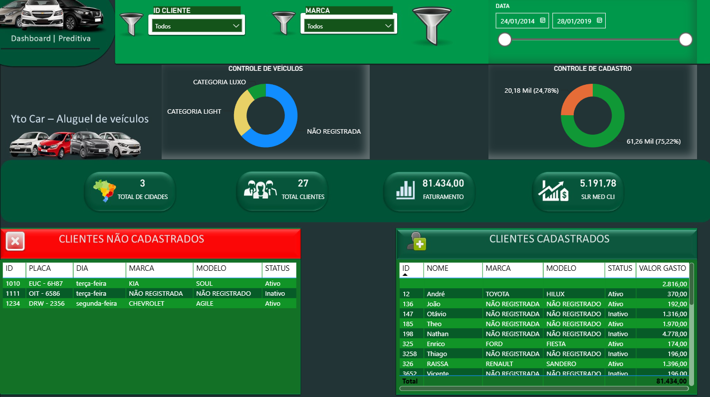
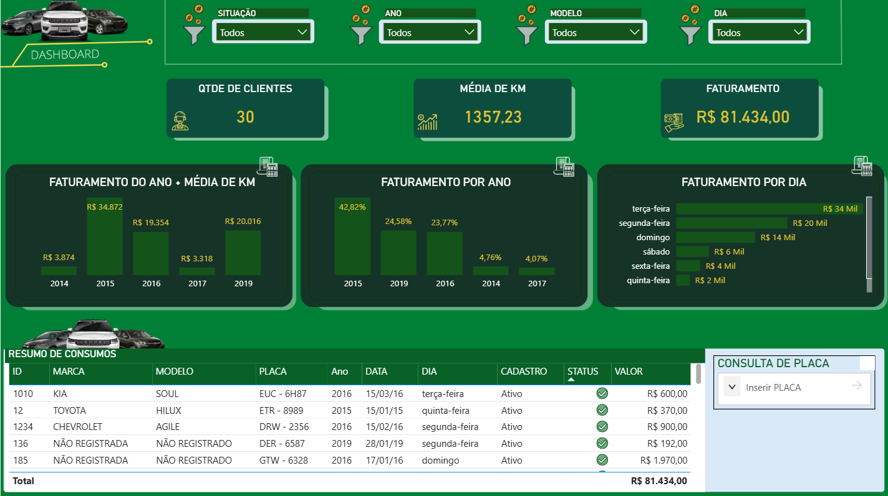
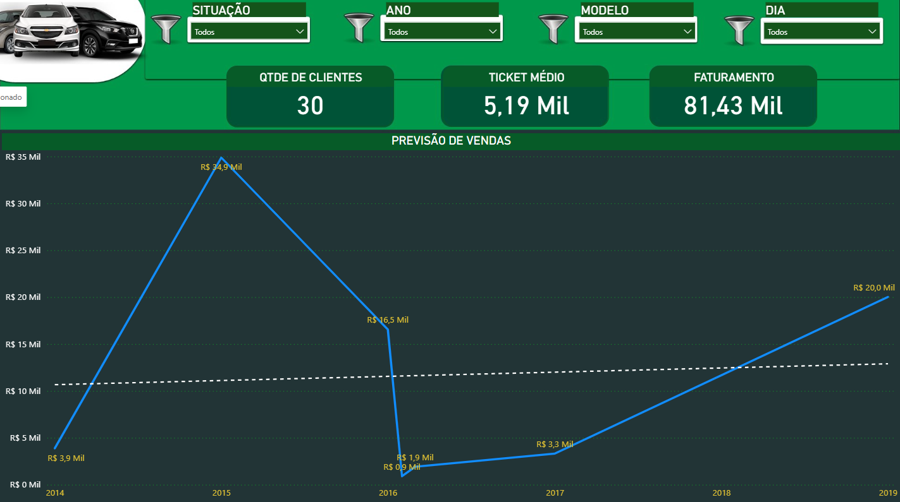

# 🚗 Dashboard de Gestão para Empresa de Locação de Veículos
### **Um projeto de Business Intelligence desenvolvido em Power BI para análise financeira, operacional e comercial de uma empresa de locação de veículos.**

 

  

&nbsp;&nbsp;

# 🔗 Arquivos do Projeto

> **Projeto desenvolvido para fins educacionais utilizando dados fictícios.**

- 📊 Dashboard desenvolvido no Power BI
- 📁 Base de dados em Excel
- 📈 Indicadores Estratégicos (KPIs)
- 📷 Capturas do Dashboard

---

# 📌 1. Resumo Executivo

Este projeto foi desenvolvido com o objetivo de simular um ambiente corporativo de uma empresa de locação de veículos, aplicando conceitos de Business Intelligence para transformar dados em informações estratégicas.

O dashboard foi projetado para fornecer uma visão integrada das operações da empresa, permitindo acompanhar indicadores financeiros, desempenho da frota, comportamento dos clientes e projeções de crescimento.

Todo o projeto foi desenvolvido utilizando boas práticas de modelagem de dados, construção de KPIs e visualização executiva.

---

# 🏗️ 2. Arquitetura e Stack Tecnológica

O projeto foi desenvolvido contemplando todas as etapas da análise de dados.

### 📂 Fonte de Dados

- Microsoft Excel
- Base de dados fictícia

### 🔄 ETL

- Power Query
- Tratamento de dados
- Padronização
- Limpeza de inconsistências

### 📊 Modelagem

- Modelo Estrela
- Relacionamentos
- Medidas DAX
- KPIs

### 📈 Visualização

- Power BI
- Dashboards Executivos
- Segmentações
- Indicadores
- Navegação entre páginas

---

# 🚀 3. Desenvolvimento do Projeto

## 🔹 Modelagem dos Dados

Foi realizada a modelagem do banco de dados utilizando relacionamentos entre tabelas para permitir uma análise consistente das informações.

Também foram desenvolvidas medidas em DAX para cálculo de indicadores financeiros, operacionais e comerciais.

---

## 🔹 Construção dos Indicadores

Foram criados diversos KPIs para acompanhamento do desempenho da empresa, entre eles:

- Receita Total
- Receita Diária
- Clientes Ativos
- Clientes Inativos
- Veículos Mais Rentáveis
- Custos Operacionais
- Quilometragem Total
- Projeção de Vendas

---

## 🔹 Desenvolvimento do Dashboard

O dashboard foi desenvolvido seguindo princípios de Data Visualization, priorizando simplicidade, organização visual e facilidade de interpretação dos dados.

Foram utilizados:

- Cartões (KPIs)
- Gráficos de barras
- Gráficos de linhas
- Segmentações
- Navegação entre páginas
- Layout corporativo

---

# 📊 4. Principais Indicadores

## 💰 Financeiro

- Faturamento anual
- Receita diária
- Evolução do faturamento
- Receita por veículo

---

## 👥 Clientes

- Clientes ativos
- Clientes inativos
- Cadastro de clientes
- Evolução da carteira

---

## 🚙 Frota

- Veículos mais lucrativos
- Quilometragem total
- Custos operacionais
- Utilização da frota

---

## 📈 Projeções

- Projeção de vendas
- Crescimento anual
- Tendências do negócio

---

# 🖥️ Dashboard

## 🎯 Página Inicial

---

## 📈 Dashboard de Clientes

---

## 🚗 Dashboard Operacional

 

---

## 📊 Dashboard de Previsão

---

# 💡 6. Principais Insights

A análise dos indicadores permite identificar rapidamente:

- Evolução do faturamento da empresa.
- Veículos com maior rentabilidade.
- Perfil dos clientes ativos e inativos.
- Custos operacionais da frota.
- Tendências de crescimento para os próximos períodos.

---

# 📚 7. Competências Desenvolvidas

Durante o desenvolvimento deste projeto foram aplicados conhecimentos em:

- Business Intelligence
- Power BI
- Power Query
- DAX
- Modelagem de Dados
- ETL
- Storytelling com Dados
- Data Visualization
- Construção de KPIs

---

# 🎯 8. Objetivos Alcançados

✔ Desenvolvimento de dashboard executivo

✔ Construção de indicadores estratégicos

✔ Aplicação de boas práticas em Business Intelligence

✔ Modelagem de dados

✔ Desenvolvimento de medidas DAX

✔ Criação de visualizações executivas

---

# 🎓 9. Contexto do Projeto

Projeto desenvolvido durante os estudos em Power BI, com orientação do Professor Danilo Maciel (Yto Nihon Treinamentos).

Todos os dados utilizados são fictícios e possuem finalidade exclusivamente educacional.

---

## 👨‍💻 Autor

### **Robson Pereira Machado**

**Analista de Dados em Formação**

Power BI • SQL • Python • Excel • Business Intelligence • Data Analytics

