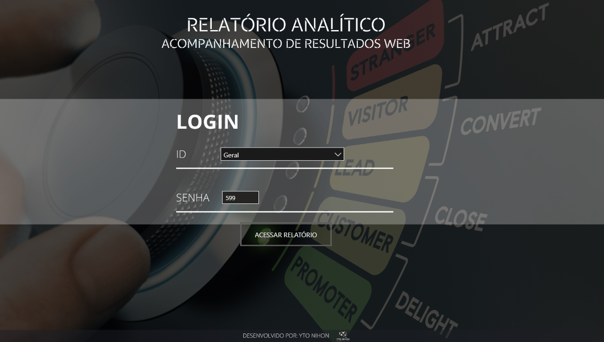

# 📊 Projeto 03 — Análise de Marketing


---

## 📊 Dashboard Interativo

Clique no botão abaixo para acessar o dashboard completo e interagir com os filtros e indicadores:

<p align="center">
  <a href="https://app.powerbi.com/view?r=eyJrIjoiODZmYzM5NmEtZDdhYy00NzRhLTg2MzctYzQzM2E4OWM5YTAwIiwidCI6IjY1OWNlMmI4LTA3MTQtNDE5OC04YzM4LWRjOWI2MGFhYmI1NyJ9" target="_blank">
    
  </a>
</p>

### 📸 Preview do Dashboard

<p align="center">
  
</p>


## 📌 Sobre o Projeto

Este projeto apresenta o desenvolvimento de um **Dashboard de Análise de Marketing utilizando Power BI**, com foco no acompanhamento do desempenho de campanhas, investimentos em anúncios e valores convertidos em vendas.

Além da análise dos indicadores de marketing, o projeto também explora recursos do Power BI como **filtros, segmentações de dados, parâmetros, medidas DAX e validação de login e senha**, permitindo direcionar diferentes usuários para páginas específicas do relatório.

---

## 🎯 Objetivo

O objetivo do projeto é desenvolver um painel de acompanhamento de campanhas de marketing que permita analisar:

- 💰 Valor gasto em campanhas;
- 💵 Valor convertido em vendas;
- 📊 Faturamento por campanha;
- 👤 Desempenho por gerente;
- 🔢 Quantidade de execuções;
- 📈 Percentual de crescimento;
- 📣 Desempenho das campanhas;
- 🔐 Controle de acesso por login e senha.

---

## 🛠️ Ferramentas Utilizadas

| Ferramenta | Utilização |
|---|---|
| **Power BI** | Construção do dashboard e análise dos dados |
| **Power Query** | Tratamento e transformação dos dados |
| **DAX** | Criação de medidas e regras de validação |
| **Parâmetros** | Criação da entrada numérica utilizada na validação |
| **Segmentação de Dados** | Seleção de usuários e filtros |

---

## 🔄 Tratamento dos Dados

Durante o desenvolvimento do projeto foram realizados tratamentos e ajustes nos dados para possibilitar a construção dos indicadores.

Entre os principais tratamentos estão:

- Conversão dos valores para os formatos adequados;
- Criação do valor convertido;
- Organização do valor gasto por anúncio;
- Cálculo do percentual de crescimento;
- Preparação dos campos utilizados nos filtros;
- Organização dos dados para utilização nos visuais do Power BI.

Um dos cálculos trabalhados no projeto utiliza o valor convertido e o valor gasto por anúncio para calcular um percentual de crescimento.

---

## 📊 Indicadores Desenvolvidos

### 💰 Valor Gasto por Campanha

Indicador utilizado para acompanhar quanto foi investido nas campanhas de marketing.

A análise permite visualizar as despesas relacionadas aos anúncios e campanhas.

### 💵 Valor Convertido em Vendas

Representa o valor convertido pelas campanhas e é utilizado como referência para análise do faturamento.

### 📈 Percentual de Crescimento

Indicador utilizado para analisar a relação entre o valor convertido e o valor gasto nos anúncios.

### 🔢 Quantidade de Execuções

Permite acompanhar a quantidade de execuções realizadas pelas campanhas.

### 👤 Análise por Gerente

O dashboard permite analisar individualmente os resultados dos gerentes responsáveis pelas campanhas.

---

# 📑 Relatórios Desenvolvidos

## 🔵 Relatório Google

Página direcionada para a análise das campanhas relacionadas ao Google.

O relatório apresenta informações como:

- Valor gasto;
- Valor convertido;
- Desempenho das campanhas;
- Gerente responsável.

Foi aplicado um filtro de página para apresentar somente os dados do gerente selecionado.

---

## 🟣 Relatório Instagram

Página direcionada para as campanhas relacionadas ao Instagram.

A estrutura foi baseada no relatório anterior, utilizando filtros para apresentar somente as métricas correspondentes ao gerente responsável pelas campanhas.

---

## 📊 Relatório Geral

Página responsável pela consolidação dos dados das campanhas.

Nessa visão são apresentados dados dos diferentes gerentes, incluindo:

- Faturamento por campanha;
- Valor gasto;
- Valor convertido;
- Gerente responsável;
- Quantidade de execuções;
- Percentual de crescimento.

O relatório geral permite visualizar os resultados de forma consolidada e comparar o desempenho das campanhas.

---

# 🧮 DAX

Durante o desenvolvimento foram utilizadas medidas DAX para tornar o relatório mais dinâmico.

Uma das medidas utilizadas trabalha com a função `SELECTEDVALUE`, permitindo retornar o gerente selecionado no contexto do relatório.

### Exemplo

```DAX
Gerente =
SELECTEDVALUE(
    'tb base campanha'[Gerente da Campanha]
)