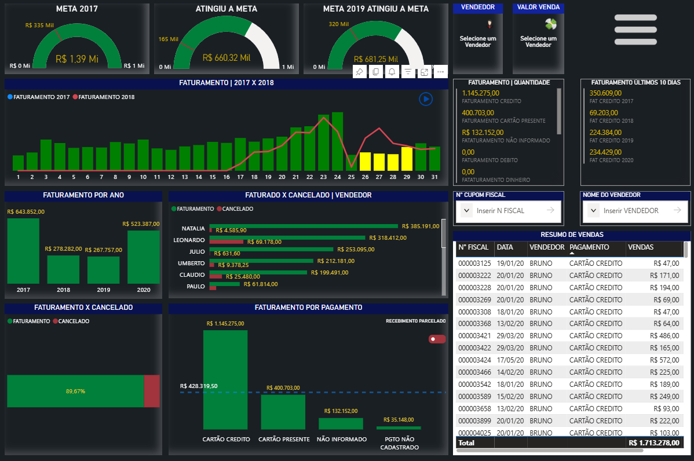
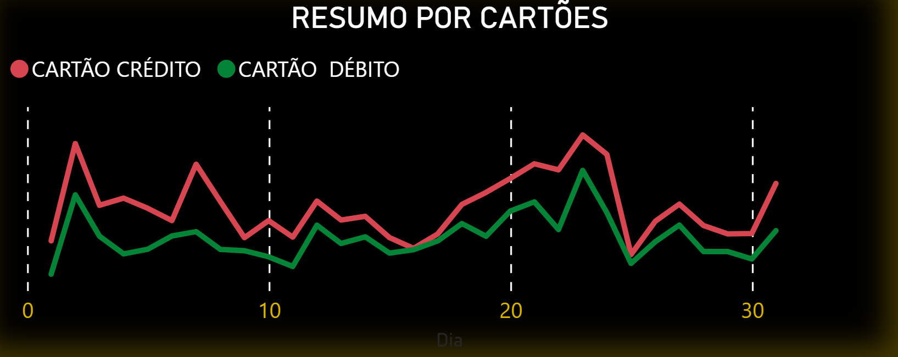

# 📊 Projeto 02 — Análise de Vendas | Business Intelligence

<p align="center">

  
  
  
  

</p>

<p align="center">

<strong>Business Intelligence • ETL • Power Query • DAX • Modelagem de Dados • Dashboard Interativo</strong>

</p>

---

# 📌 Visão Geral

O **Projeto 02 — Análise de Vendas** é um projeto de **Business Intelligence desenvolvido no Power BI**, com foco na preparação, tratamento, consolidação e análise de dados de vendas.

O projeto foi desenvolvido durante meus estudos de **Power BI**, utilizando bases de diferentes períodos para construir uma estrutura única e adequada à análise.

O processo envolveu etapas de:

* Importação dos dados;
* Tratamento das tabelas;
* Padronização das informações;
* Consolidação das bases;
* Criação de novas colunas;
* Aplicação de regras condicionais;
* Processo de De-Para;
* Organização das consultas;
* Modelagem dos dados;
* Criação de indicadores;
* Desenvolvimento de um dashboard interativo.

> 💡 O principal aprendizado deste projeto foi compreender como transformar diferentes bases de dados em uma estrutura consolidada e organizada para análise no Power BI.

---

# 🎯 Objetivo do Projeto

O principal objetivo foi **unificar as bases de vendas dos anos de 2017, 2018 e 2019**, realizando o tratamento e a transformação dos dados antes da construção do dashboard.

O projeto busca demonstrar o processo completo de preparação dos dados, desde a importação das planilhas até sua utilização em um ambiente de Business Intelligence.

Entre os principais objetivos estão:

* Consolidar bases de diferentes períodos;
* Corrigir inconsistências nos dados;
* Padronizar campos;
* Trabalhar tipos de dados;
* Criar informações derivadas;
* Substituir códigos por informações descritivas;
* Organizar o processo de ETL;
* Preparar os dados para análise;
* Desenvolver um dashboard interativo.

---

# 🧠 Desafio de Dados

O principal desafio foi trabalhar com diferentes arquivos de origem e transformá-los em uma estrutura única para análise.

As bases utilizadas possuem informações referentes a diferentes períodos, exigindo tratamento individual antes da consolidação.

Fluxo simplificado:

```text
BASE 2017
   │
   ├──────────────┐
   │              │
BASE 2018         │
   │              ▼
   ├──────────> TRATAMENTO
   │              │
BASE 2019         │
   │              ▼
   └────────> CONSOLIDAÇÃO
                  │
                  ▼
             MODELO DE DADOS
                  │
                  ▼
               POWER BI
                  │
                  ▼
              DASHBOARD
```

Essa estrutura permitiu trabalhar os dados de diferentes períodos de maneira padronizada.

---

# 🏗️ Arquitetura do Projeto

O projeto foi estruturado com foco no fluxo de **tratamento, transformação e análise de dados**.

```text
                 DADOS
                   │
                   ▼
             POWER QUERY
                   │
          ┌────────┴────────┐
          │                 │
       LIMPEZA          PADRONIZAÇÃO
          │                 │
          └────────┬────────┘
                   │
                   ▼
             CONSOLIDAÇÃO
                   │
                   ▼
            MODELAGEM
                   │
                   ▼
                 DAX
                   │
                   ▼
              DASHBOARD
```

A estrutura permite acompanhar a evolução dos dados desde a origem até sua utilização nos indicadores e visualizações.

---

# 📂 Dados Utilizados

O projeto utiliza bases de metas e vendas organizadas por período.

Arquivos presentes no projeto:

```text
dados/
├── 4_1_meta_2017.xlsx
├── 4_1_meta_2018.xlsx
├── 4_1_meta_2019.xlsx
└── meta_2020.xlsx
```

Esses arquivos foram utilizados como fonte para o processo de preparação e análise dos dados.

---

# 🔄 ETL — Power Query

O processo de preparação dos dados foi realizado principalmente utilizando o **Power Query**.

Fluxo geral:

```text
Fonte de Dados
      ↓
Importação
      ↓
Tratamento
      ↓
Correção dos Tipos
      ↓
Padronização
      ↓
Transformações
      ↓
Consolidação
      ↓
Modelo de Dados
      ↓
Power BI
```

---

# 🧹 Tratamento dos Dados

Antes da consolidação, cada tabela foi tratada individualmente.

Entre as principais etapas realizadas estão:

* Promoção do cabeçalho;
* Correção dos tipos de dados;
* Conversão de datas;
* Tratamento de erros;
* Padronização dos campos;
* Organização das colunas;
* Criação de novas colunas;
* Aplicação de condições;
* Tratamento de informações auxiliares.

O objetivo foi garantir maior consistência entre as diferentes bases antes da consolidação.

---

# 🔗 Consolidação das Bases

Após o tratamento individual das tabelas, foi realizada a consolidação das informações.

As bases trabalhadas incluem:

```text
Vendas 2017
     │
     ├──────┐
Vendas 2018│
     │      │
     ├──────┤
Vendas 2019│
     │      │
     └──┬───┘
        ▼
BASE CONSOLIDADA
```

A consolidação possibilitou trabalhar diferentes períodos dentro de uma estrutura única.

---

# 🔄 Transformações Realizadas

Durante o processo de ETL foram utilizadas diferentes transformações no Power Query.

Entre elas:

* Substituição de códigos;
* Criação de novas colunas;
* Colunas condicionais;
* Conversão de tipos;
* Padronização do tamanho dos campos;
* Organização das consultas;
* Remoção de etapas desnecessárias;
* Ocultação de colunas auxiliares;
* Padronização das informações.

Essas transformações contribuíram para melhorar a organização e a qualidade do modelo.

---

# 🔁 Conceito De-Para

Um dos conceitos praticados no projeto foi o **De-Para**.

O objetivo foi substituir códigos por informações mais compreensíveis para o usuário final.

Exemplo conceitual:

| Código | Vendedor |
| ------ | -------- |
| 01     | João     |
| 02     | Maria    |
| 03     | Carlos   |

Esse processo melhora a interpretação dos dados e torna as visualizações mais intuitivas.

---

# 📐 DAX

O projeto também envolveu a utilização de **DAX — Data Analysis Expressions** para criação e organização dos cálculos utilizados no Power BI.

Os estudos realizados incluíram conceitos relacionados a:

```text
Medidas
   │
   ├── Agregações
   ├── Cálculos
   ├── Indicadores
   └── Contexto de filtro
```

Os principais conceitos de DAX utilizados no projeto estão documentados em:

```text
scripts/
└── dax.md
```

---

# 💳 Formas de Pagamento

Durante o desenvolvimento também foram estudadas informações relacionadas às formas de pagamento utilizadas na análise.

As anotações estão organizadas em:

```text
scripts/
└── formas_pagamento.md
```

Esse material faz parte das anotações técnicas utilizadas durante o desenvolvimento do projeto.

---

# 📊 Estrutura do Dashboard

O projeto possui um dashboard desenvolvido no **Power BI**, utilizando os dados tratados e consolidados durante o processo de ETL.

O arquivo principal está localizado em:

```text
dashboard/
└── analise-vendas.pbix
```

O relatório utiliza recursos de:

* Indicadores;
* Gráficos;
* Filtros;
* Segmentações;
* Navegação;
* Elementos visuais;
* Análises temporais;
* Interação entre elementos.

---

# 🖥️ Dashboard

## 📊 Dashboard — Visão 01

<p align="center">

  

</p>

Primeira visualização do dashboard desenvolvido para análise dos dados de vendas.

---

## 📈 Dashboard — Visão 02

<p align="center">

  

</p>

Segunda visualização utilizada para aprofundar a análise das informações disponíveis.

---

## 📊 Dashboard — Visão 03

<p align="center">

  

</p>

Terceira visualização do relatório, complementando a análise realizada no projeto.

---

# 📊 Principais Análises

O projeto foi desenvolvido para possibilitar diferentes perspectivas de análise dos dados.

Entre os principais focos estão:

### 📈 Análise de Vendas

Avaliação das informações de vendas após o processo de tratamento e consolidação.

### 📅 Análise Temporal

Comparação dos dados entre diferentes períodos.

### 🎯 Análise de Metas

Utilização das bases de metas para apoiar análises de desempenho.

### 👥 Análise de Vendedores

Aplicação do conceito de De-Para para transformar códigos em informações mais descritivas.

### 💳 Formas de Pagamento

Organização e análise das informações relacionadas às formas de pagamento.

---

# 🧠 Principais Aprendizados

Este projeto contribuiu para o desenvolvimento de conhecimentos em diferentes áreas de Business Intelligence.

### 🔄 Power Query

* Importação;
* Limpeza;
* Transformação;
* Padronização;
* Consolidação;
* Organização das consultas;
* Tratamento de erros.

### 📐 DAX

* Criação de cálculos;
* Medidas;
* Indicadores;
* Contexto de filtro;
* Organização das expressões.

### 📊 Power BI

* Modelagem;
* Visualizações;
* Filtros;
* Segmentações;
* Navegação;
* Construção de dashboards.

### 📈 Análise de Dados

* Consolidação de bases;
* Comparação de períodos;
* Análise de metas;
* Organização de informações;
* Transformação de dados em informações úteis.

---

# 🎨 Design e Identidade Visual

O dashboard foi desenvolvido buscando uma apresentação visual organizada e intuitiva.

Entre os elementos utilizados estão:

* Cards de indicadores;
* Gráficos;
* Filtros;
* Segmentações;
* Elementos de navegação;
* Organização visual das informações;
* Recursos interativos do Power BI.

---

# 🧭 Fluxo do Projeto

O desenvolvimento seguiu um fluxo baseado nas principais etapas de um projeto de Business Intelligence:

```text
ENTENDIMENTO DOS DADOS
        ↓
IMPORTAÇÃO
        ↓
TRATAMENTO
        ↓
PADRONIZAÇÃO
        ↓
CONSOLIDAÇÃO
        ↓
MODELAGEM
        ↓
DAX
        ↓
DASHBOARD
        ↓
ANÁLISE
```

Essa estrutura demonstra a evolução desde os dados brutos até a construção das visualizações.

---

# 🛠️ Tecnologias

<p align="center">

  
  
  
  

</p>

| Tecnologia      | Aplicação                                |
| --------------- | ---------------------------------------- |
| **Power BI**    | Dashboard, modelagem e visualização      |
| **Power Query** | Tratamento, transformação e consolidação |
| **DAX**         | Medidas, cálculos e indicadores          |
| **Excel**       | Fonte dos dados                          |

---

# 📂 Estrutura do Repositório

```text
projeto-02-analise-de-vendas/

│
├── README.md
│
├── dados/
│   ├── 4_1_meta_2017.xlsx
│   ├── 4_1_meta_2018.xlsx
│   ├── 4_1_meta_2019.xlsx
│   └── meta_2020.xlsx
│
├── dashboard/
│   └── analise-vendas.pbix
│
├── imagens/
│   ├── dashboard-01.png
│   ├── dashboard-02.png
│   └── dashboard-03.png
│
└── scripts/
    ├── dax.md
    └── formas_pagamento.md
```

---

# 📌 Competências Demonstradas

Este projeto demonstra conhecimentos em:

```text
Business Intelligence
        │
        ├── Power BI
        │
        ├── Power Query
        │
        ├── ETL
        │
        ├── Tratamento de Dados
        │
        ├── Consolidação de Bases
        │
        ├── Modelagem de Dados
        │
        ├── DAX
        │
        ├── Análise de Vendas
        │
        ├── Análise de Metas
        │
        ├── De-Para
        │
        └── Data Visualization
```

---

# 📚 Conteúdos Praticados

* [x] Importação de dados
* [x] Power Query
* [x] ETL
* [x] Tratamento de dados
* [x] Correção de tipos
* [x] Padronização
* [x] Consolidação de bases
* [x] Criação de colunas
* [x] Colunas condicionais
* [x] Processo De-Para
* [x] Modelagem de dados
* [x] DAX
* [x] Indicadores
* [x] Análise de vendas
* [x] Análise de metas
* [x] Análise temporal
* [x] Formas de pagamento
* [x] Dashboard interativo
* [x] Data Visualization

---

# 📈 Evolução do Projeto

Este projeto representa uma etapa importante na evolução das minhas habilidades em **Data Analytics e Business Intelligence**.

Além da construção do dashboard, o projeto permitiu praticar diferentes etapas do processo analítico:

```text
DADOS
  ↓
TRATAMENTO
  ↓
ETL
  ↓
CONSOLIDAÇÃO
  ↓
MODELAGEM
  ↓
DAX
  ↓
INDICADORES
  ↓
DASHBOARD
  ↓
ANÁLISE
```

A experiência contribuiu para compreender melhor o processo de transformar dados brutos em informações organizadas para apoiar análises.

---

# 📌 Status do Projeto

🟢 **Concluído**

Projeto desenvolvido para prática e consolidação de conhecimentos em:

**Power BI • Power Query • DAX • Excel • ETL • Modelagem de Dados • Business Intelligence**

---

# 👨‍💻 Autor

**Robson Pereira Machado**

📊 Data Analytics | Business Intelligence

💻 Power BI • SQL • Python • Excel

🎓 Ciência de Dados

---

# 🔗 Portfólio

Este projeto faz parte do meu portfólio de projetos em **Data Analytics**.

📁 **Repositório principal:**

`portfolio-data-analytics`

---

<p align="center">

⭐ <strong>Obrigado por visitar este projeto!</strong>

</p>

<p align="center">

<strong>Transformando dados em informações para apoiar decisões.</strong>

</p>