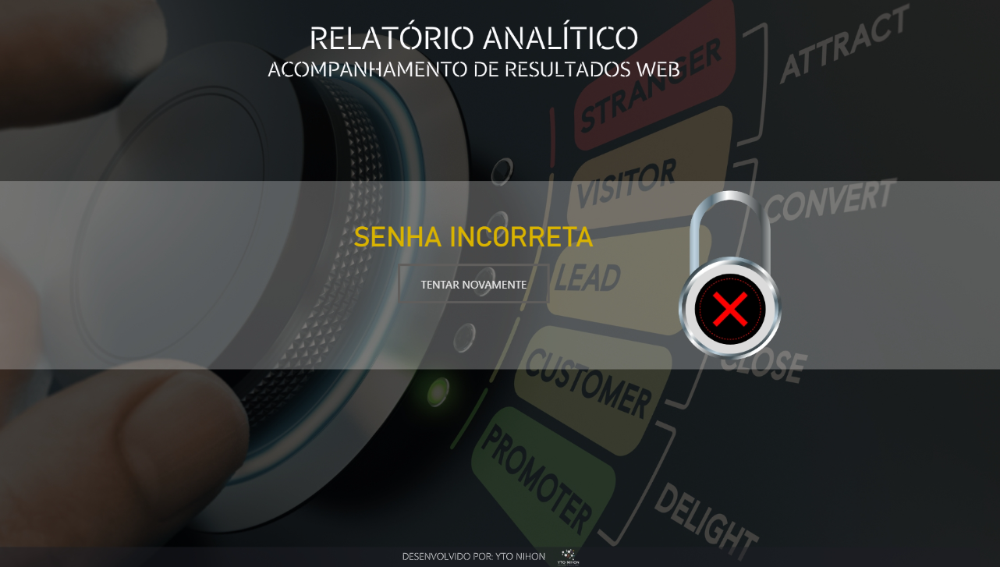
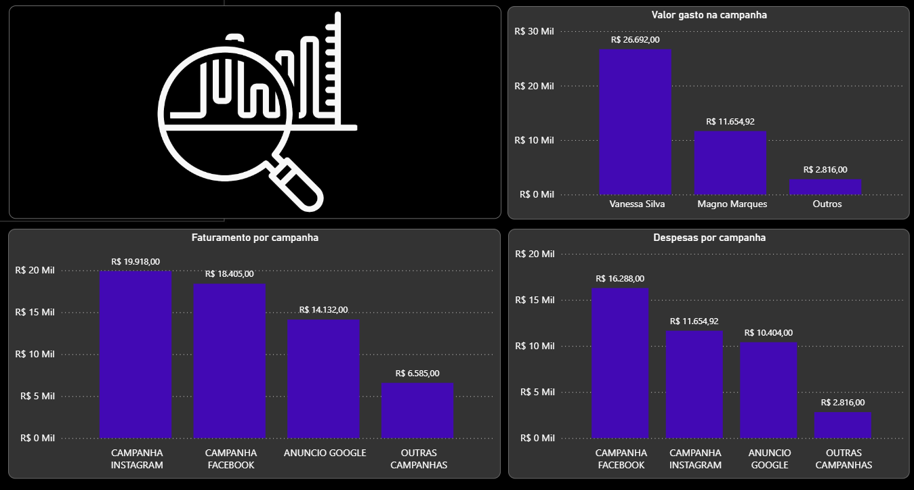
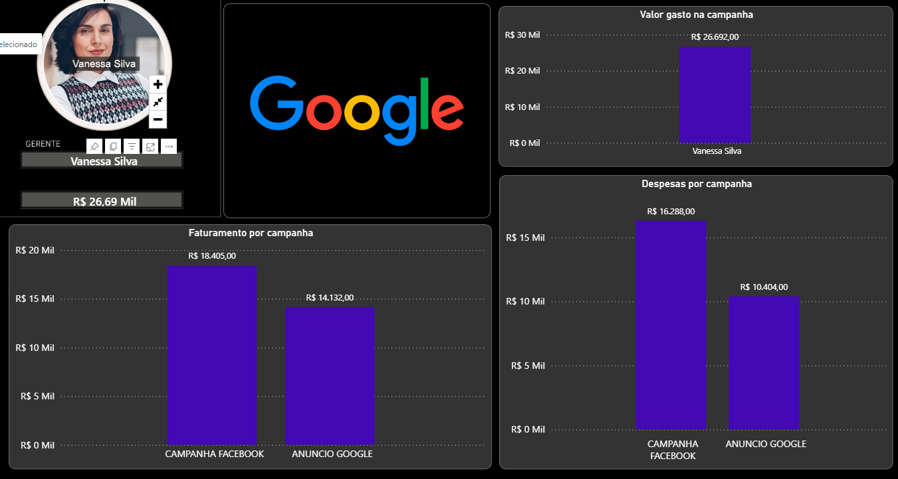
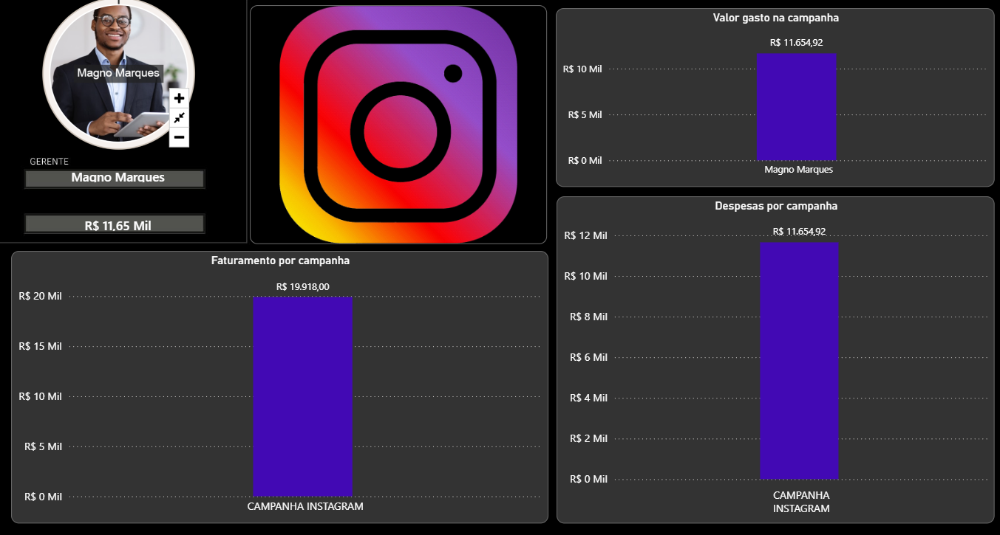

# 📣 Projeto 03 — Análise de Marketing | Business Intelligence

<p align="center">

  
  
  
  

</p>

<p align="center">

<strong>Business Intelligence • Marketing Analytics • Power Query • DAX • Dashboard Interativo</strong>

</p>

---

# 📌 Visão Geral

O **Projeto 03 — Análise de Marketing** é um projeto de **Business Intelligence desenvolvido no Power BI**, com foco na análise do desempenho de campanhas de marketing, investimentos em anúncios e valores convertidos em vendas.

O projeto foi desenvolvido durante meus estudos de **Power BI**, explorando recursos de tratamento de dados, medidas DAX, filtros, segmentações, parâmetros e navegação entre páginas.

Além da análise dos indicadores de marketing, o projeto também apresenta uma estrutura de **validação de usuário**, utilizando seleção de informações e regras desenvolvidas no Power BI para direcionar diferentes usuários às páginas correspondentes do relatório.

> 💡 O principal aprendizado deste projeto foi compreender como utilizar o Power BI não apenas para visualizar dados, mas também para construir relatórios interativos com regras, filtros e diferentes níveis de acesso à informação.

---

# 🎯 Objetivo do Projeto

O objetivo foi desenvolver um dashboard capaz de acompanhar o desempenho das campanhas de marketing e analisar seus principais indicadores.

O projeto permite analisar:

* 💰 Valor gasto em campanhas;
* 💵 Valor convertido em vendas;
* 📊 Faturamento por campanha;
* 👤 Desempenho por gerente;
* 🔢 Quantidade de execuções;
* 📈 Percentual de crescimento;
* 📣 Desempenho das campanhas;
* 🔎 Resultados por canal de marketing.

---

# 🧠 Desafio de Dados

O desafio do projeto consistiu em transformar os dados das campanhas em indicadores que permitissem acompanhar o desempenho dos investimentos em marketing.

O processo pode ser representado da seguinte forma:

```text
DADOS DAS CAMPANHAS
        ↓
TRATAMENTO
        ↓
TRANSFORMAÇÃO
        ↓
MEDIDAS DAX
        ↓
INDICADORES
        ↓
FILTROS E SEGMENTAÇÕES
        ↓
DASHBOARD
        ↓
ANÁLISE DE MARKETING
```

A estrutura permite analisar diferentes campanhas, gerentes e canais de divulgação dentro de um mesmo relatório.

---

# 🏗️ Arquitetura do Projeto

O projeto utiliza o Power BI como ambiente central para tratamento, modelagem e visualização dos dados.

```text
              DADOS
                │
                ▼
          POWER QUERY
                │
                ▼
        TRATAMENTO / ETL
                │
                ▼
        MODELO DE DADOS
                │
        ┌───────┴───────┐
        ▼               ▼
       DAX          PARÂMETROS
        │               │
        └───────┬───────┘
                ▼
       FILTROS / SEGMENTAÇÕES
                │
                ▼
            DASHBOARD
```

---

# 📂 Dados Utilizados

O projeto possui duas planilhas utilizadas como fonte de dados:

```text
dados/
├── SENHA.xlsx
└── TB_BASES.xlsx
```

A planilha `TB_BASES.xlsx` está relacionada às informações utilizadas na análise das campanhas.

A planilha `SENHA.xlsx` é utilizada no processo desenvolvido para validação de usuário dentro do relatório.

---

# 🔄 ETL — Power Query

O processo de preparação dos dados foi realizado utilizando o **Power Query**.

Fluxo geral:

```text
Fonte de Dados
      ↓
Importação
      ↓
Tratamento
      ↓
Alteração de Tipos
      ↓
Organização
      ↓
Criação de Campos
      ↓
Modelo de Dados
      ↓
Power BI
```

---

# 🧹 Tratamento dos Dados

Durante o desenvolvimento foram realizados diferentes tratamentos para preparar os dados para análise.

Entre as etapas trabalhadas estão:

* Conversão dos valores para os formatos adequados;
* Organização dos valores gastos por anúncio;
* Criação do valor convertido;
* Preparação dos campos utilizados nos filtros;
* Cálculo do percentual de crescimento;
* Organização das informações utilizadas nos visuais;
* Preparação dos dados para as medidas DAX.

Essas transformações permitiram estruturar os dados para a criação dos indicadores do dashboard.

---

# 📊 Indicadores Desenvolvidos

O dashboard apresenta diferentes indicadores relacionados ao desempenho das campanhas.

## 💰 Valor Gasto por Campanha

Indicador utilizado para acompanhar o investimento realizado nas campanhas de marketing.

Permite analisar os valores destinados aos anúncios e campanhas.

---

## 💵 Valor Convertido em Vendas

Representa o valor convertido pelas campanhas e serve como referência para analisar o retorno financeiro das ações de marketing.

---

## 📈 Percentual de Crescimento

Indicador utilizado para analisar a relação entre o valor convertido e o valor gasto nos anúncios.

Essa métrica permite avaliar o desempenho financeiro das campanhas.

---

## 🔢 Quantidade de Execuções

Permite acompanhar a quantidade de execuções realizadas pelas campanhas.

Esse indicador contribui para a análise operacional das ações de marketing.

---

## 👤 Análise por Gerente

O dashboard permite analisar individualmente os resultados dos gerentes responsáveis pelas campanhas.

Essa visão possibilita comparar o desempenho entre diferentes responsáveis.

---

# 📣 Análise por Canal

O projeto possui páginas específicas para diferentes canais de marketing.

```text
CANAIS
  │
  ├── GOOGLE
  │
  ├── INSTAGRAM
  │
  └── GERAL
```

Essa organização permite analisar cada canal individualmente e também observar os resultados de forma consolidada.

---

# 🔵 Relatório Google

A página **Google** é dedicada à análise das campanhas relacionadas ao Google.

Entre as informações analisadas estão:

* Valor gasto;
* Valor convertido;
* Desempenho das campanhas;
* Gerente responsável;
* Indicadores de desempenho.

Foi utilizado filtro de página para apresentar os dados de acordo com o gerente selecionado.

---

# 🟢 Relatório Instagram

A página **Instagram** é dedicada às campanhas relacionadas ao Instagram.

A estrutura permite analisar as métricas das campanhas e aplicar filtros para visualizar os resultados de acordo com o gerente responsável.

---

# 📊 Relatório Geral

A página **Geral** consolida os dados das diferentes campanhas e gerentes.

Entre as informações analisadas estão:

* Faturamento por campanha;
* Valor gasto;
* Valor convertido;
* Gerente responsável;
* Quantidade de execuções;
* Percentual de crescimento.

Essa visão permite comparar os resultados de forma consolidada.

---

# 🔐 Validação de Usuário

Uma das funcionalidades desenvolvidas neste projeto foi uma lógica de **validação de usuário utilizando Power BI**.

O relatório utiliza informações relacionadas a usuário e senha para realizar a validação antes da apresentação das páginas correspondentes.

O fluxo pode ser representado como:

```text
USUÁRIO
   ↓
ENTRADA DE DADOS
   ↓
VALIDAÇÃO
   ↓
      ┌───────────────┐
      │               │
   CORRETO          INCORRETO
      │               │
      ▼               ▼
 ACESSO AO        MENSAGEM DE
 RELATÓRIO          ERRO
```

Essa funcionalidade foi construída utilizando recursos como **parâmetros, medidas DAX, filtros e segmentações**.

---

# 📐 DAX

O projeto utiliza **DAX — Data Analysis Expressions** para criar medidas e regras utilizadas no relatório.

Um dos conceitos trabalhados foi a função `SELECTEDVALUE`.

### Exemplo

```DAX
Gerente =
SELECTEDVALUE(
    'tb base campanha'[Gerente da Campanha]
)
```

Essa medida permite retornar o gerente selecionado dentro do contexto do relatório.

O uso do DAX contribui para tornar o dashboard mais dinâmico e interativo.

---

# ⚙️ Parâmetros

Os parâmetros foram utilizados como parte da lógica de entrada de informações e validação do relatório.

Essa funcionalidade possibilitou trabalhar com informações selecionadas pelo usuário e utilizar esses valores dentro das regras criadas no Power BI.

---

# 🎛️ Filtros e Segmentações

O projeto utiliza diferentes recursos de interação do Power BI.

Entre eles:

* Filtros de página;
* Segmentações de dados;
* Seleção de gerente;
* Parâmetros;
* Navegação entre páginas.

Esses recursos permitem personalizar a análise de acordo com o contexto selecionado.

---

# 🖥️ Dashboard

## 🔐 Tela de Login

<p align="center">

  

</p>

Tela inicial desenvolvida para a entrada e validação das informações do usuário.

---

## ❌ Senha Incorreta

<p align="center">

  

</p>

Tela apresentada quando as informações utilizadas na validação não correspondem aos dados esperados.

---

## 📊 Visão Geral

<p align="center">

  

</p>

Página destinada à consolidação dos principais indicadores das campanhas de marketing.

---

## 🔎 Google

<p align="center">

  

</p>

Página destinada à análise das campanhas relacionadas ao Google.

---

## 📱 Instagram

<p align="center">

  

</p>

Página destinada à análise das campanhas relacionadas ao Instagram.

---

# 🌐 Dashboard Interativo

O projeto possui uma versão publicada no **Power BI Service**.

<p align="center">

  <a href="https://app.powerbi.com/view?r=eyJrIjoiODZmYzM5NmEtZDdhYy00NzRhLTg2MzctYzQzM2E4OWM5YTAwIiwidCI6IjY1OWNlMmI4LTA3MTQtNDE5OC04YzM4LWRjOWI2MGFhYmI1NyJ9" target="_blank">
    
  </a>

</p>

---

# 🛠️ Tecnologias

<p align="center">

  
  
  
  

</p>

| Tecnologia       | Aplicação                                    |
| ---------------- | -------------------------------------------- |
| **Power BI**     | Dashboard, modelagem e visualização          |
| **Power Query**  | Tratamento e transformação dos dados         |
| **DAX**          | Medidas, cálculos e regras de validação      |
| **Excel**        | Fonte dos dados                              |
| **Parâmetros**   | Entrada de informações e lógica de validação |
| **Segmentações** | Filtros e interação com o relatório          |

---

# 📂 Estrutura do Repositório

```text
projeto-03-marketing/

│
├── README.md
│
├── dados/
│   ├── SENHA.xlsx
│   └── TB_BASES.xlsx
│
├── dashboard/
│   └── marketing.pbix
│
├── imagens/
│   ├── geral.png
│   ├── google.png
│   ├── instagram.png
│   ├── login.png
│   └── senha-incorreta.png
│
└── scripts/
```

---

# 📊 Principais Análises

O dashboard permite realizar diferentes análises relacionadas ao desempenho das campanhas.

### 💰 Investimento

Análise do valor gasto nas campanhas.

### 💵 Conversão

Análise do valor convertido em vendas.

### 📈 Crescimento

Avaliação percentual do desempenho das campanhas.

### 👤 Gerentes

Comparação dos resultados por gerente responsável.

### 📣 Canais

Análise individual dos resultados de Google e Instagram.

### 🔢 Execuções

Acompanhamento da quantidade de execuções das campanhas.

---

# 🧠 Principais Aprendizados

Este projeto contribuiu para o desenvolvimento de conhecimentos em diferentes áreas de Business Intelligence.

### 🔄 Power Query

* Importação;
* Transformação;
* Tratamento;
* Organização;
* Padronização;
* Preparação dos dados.

### 📐 DAX

* Medidas;
* `SELECTEDVALUE`;
* Contexto de filtro;
* Cálculos;
* Regras condicionais;
* Indicadores.

### 📊 Power BI

* Modelagem;
* Dashboard;
* Filtros;
* Segmentações;
* Parâmetros;
* Navegação;
* Visualizações interativas.

### 📣 Marketing Analytics

* Investimentos;
* Conversões;
* Crescimento;
* Campanhas;
* Gerentes;
* Canais de marketing.

---

# 🎨 Design e Identidade Visual

O dashboard foi desenvolvido buscando uma apresentação visual organizada e intuitiva.

Entre os elementos utilizados estão:

* Cards de indicadores;
* Gráficos;
* Filtros;
* Segmentações;
* Elementos de navegação;
* Identidade visual específica para os canais;
* Tela de login;
* Tela de validação;
* Organização dos indicadores.

---

# 📈 Fluxo do Projeto

O desenvolvimento seguiu um fluxo baseado nas principais etapas de um projeto de Business Intelligence:

```text
DADOS
  ↓
POWER QUERY
  ↓
TRATAMENTO
  ↓
MODELAGEM
  ↓
DAX
  ↓
INDICADORES
  ↓
FILTROS
  ↓
DASHBOARD
  ↓
ANÁLISE
  ↓
INSIGHTS
```

---

# 📌 Competências Demonstradas

Este projeto demonstra conhecimentos em:

```text
Business Intelligence
        │
        ├── Power BI
        │
        ├── Power Query
        │
        ├── ETL
        │
        ├── Tratamento de Dados
        │
        ├── Modelagem de Dados
        │
        ├── DAX
        │
        ├── Indicadores
        │
        ├── Marketing Analytics
        │
        ├── Análise de Campanhas
        │
        ├── Segmentação
        │
        ├── Parâmetros
        │
        ├── Validação de Usuário
        │
        └── Data Visualization
```

---

# 📚 Conteúdos Praticados

* [x] Importação de dados
* [x] Power Query
* [x] ETL
* [x] Tratamento de dados
* [x] Modelagem de dados
* [x] DAX
* [x] `SELECTEDVALUE`
* [x] Indicadores
* [x] Valor gasto
* [x] Valor convertido
* [x] Percentual de crescimento
* [x] Análise por gerente
* [x] Análise de campanhas
* [x] Análise por canal
* [x] Google
* [x] Instagram
* [x] Filtros
* [x] Segmentações
* [x] Parâmetros
* [x] Validação de usuário
* [x] Dashboard interativo
* [x] Data Visualization

---

# 📈 Evolução do Projeto

Este projeto representa uma evolução no desenvolvimento das minhas habilidades em **Data Analytics e Business Intelligence**.

Além da preparação e análise dos dados, o projeto permitiu praticar recursos de interação e desenvolvimento de regras dentro do Power BI.

```text
DADOS
  ↓
TRATAMENTO
  ↓
ETL
  ↓
MODELAGEM
  ↓
DAX
  ↓
PARÂMETROS
  ↓
FILTROS
  ↓
DASHBOARD
  ↓
ANÁLISE
```

Essa experiência contribuiu para ampliar meus conhecimentos na construção de dashboards interativos e na utilização de dados para análise de desempenho de campanhas.

---

# 📌 Status do Projeto

🟢 **Concluído**

Projeto desenvolvido para prática e consolidação de conhecimentos em:

**Power BI • Power Query • DAX • Excel • ETL • Modelagem de Dados • Marketing Analytics • Business Intelligence**

---

# 👨‍💻 Autor

**Robson Pereira Machado**

📊 Data Analytics | Business Intelligence

💻 Power BI • SQL • Python • Excel

🎓 Ciência de Dados

---

# 🔗 Portfólio

Este projeto faz parte do meu portfólio de projetos em **Data Analytics**.

📁 **Repositório principal:**

`portfolio-data-analytics`

---

<p align="center">

⭐ <strong>Obrigado por visitar este projeto!</strong>

</p>

<p align="center">

<strong>Transformando dados em informações para apoiar decisões.</strong>

</p>