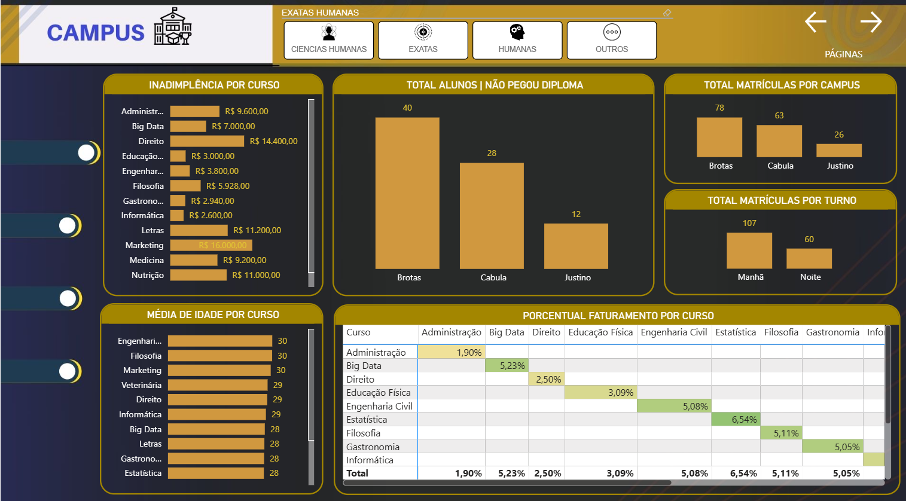
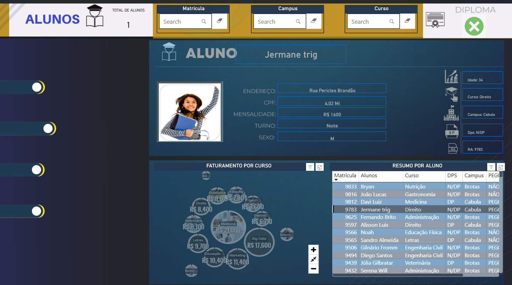
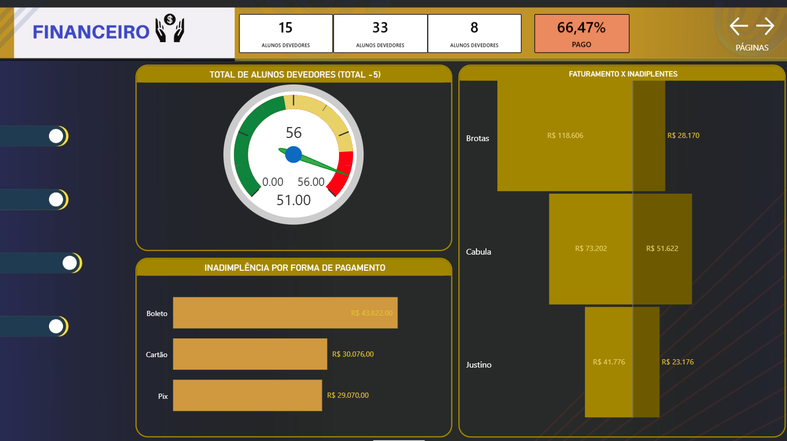
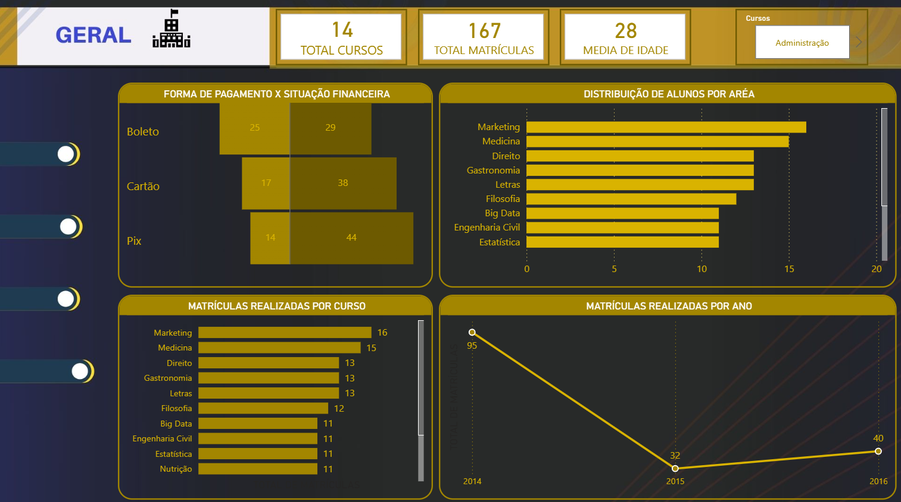

# 🎓 Projeto 04 — Universidade | Business Intelligence

<p align="center">
  
  
  
  
</p>

<p align="center">
  <strong>Modelagem de Dados • Power Query • DAX • Business Intelligence • Dashboard Interativo</strong>
</p>

---

## 📌 Visão Geral

O **Projeto 04 — Universidade** é um projeto de Business Intelligence desenvolvido no **Power BI**, com foco na análise de informações acadêmicas, financeiras e operacionais de uma instituição de ensino.

O projeto foi desenvolvido a partir de uma **tabela analítica**, contendo diferentes informações relacionadas aos alunos, cursos, campus, turnos, situação financeira e características acadêmicas.

O principal desafio foi transformar essa estrutura inicial em um modelo de dados mais organizado, utilizando os conceitos de **Tabela Fato, Tabelas Dimensão, normalização e redução de redundância**.

Além da modelagem, o projeto envolve tratamento de dados no **Power Query**, criação de medidas utilizando **DAX**, aplicação de filtros, cálculos percentuais e utilização de **variáveis com `VAR` e `RETURN`**.

> 💡 O principal aprendizado deste projeto foi compreender, na prática, como uma tabela analítica pode ser transformada em uma estrutura de dados adequada para análises no Power BI.

---

# 🎯 Objetivo do Projeto

Construir um dashboard interativo capaz de apresentar diferentes indicadores acadêmicos e financeiros, permitindo analisar informações relacionadas a:

* Alunos;
* Matrículas;
* Cursos;
* Campus;
* Turnos;
* Inadimplência;
* Faturamento;
* Diploma;
* Perfil dos alunos;
* Distribuição das matrículas;
* Participação dos cursos no faturamento.

O projeto também teve como objetivo aprofundar conhecimentos em **modelagem de dados, Power Query e DAX**.

---

# 🧠 Desafio de Dados

A base inicial apresentava uma estrutura analítica concentrando diferentes informações em uma única tabela.

Esse tipo de estrutura pode gerar **redundância**, pois determinadas informações são repetidas diversas vezes.

Por exemplo:

```text
Curso
────────────────────
Administração
Administração
Administração
Medicina
Medicina
Medicina
Engenharia Civil
Engenharia Civil
```

Em vez de manter essas informações repetidas na estrutura analítica, o projeto utiliza o conceito de dimensão para organizar os dados.

```text
DIM_CURSOS
────────────────────
Administração
Medicina
Engenharia Civil
```

Enquanto a tabela fato mantém os registros necessários para as análises.

Essa abordagem permite trabalhar com uma estrutura mais organizada e facilita a modelagem e os relacionamentos no Power BI.

---

# 🏗️ Arquitetura do Projeto

O projeto foi estruturado seguindo o conceito de **Modelo Fato e Dimensão**.

```text
                         DIM_CURSOS
                              │
                              │
DIM_CAMPOS ─────────────── F_BASE ─────────────── DIM_TURNO
                              │
                              │
                       DIM_SITUACAO
                              │
                       DIM_FORMA_PGT
                              │
                         DIM_GENERO
                              │
                           DIM_PCD
                              │
                        DIM_ESTAGIO
                              │
                        DIM_DIPLOMA
```

A tabela `F_BASE` funciona como tabela central do modelo, enquanto as dimensões armazenam informações utilizadas para classificação, filtragem e análise.

---

# 📊 Tabela Fato

A tabela principal do projeto foi denominada:

```text
F_BASE
```

Ela concentra os registros utilizados nas análises.

Entre as informações trabalhadas estão:

* Matrícula;
* Aluno;
* Curso;
* Campus;
* Turno;
* Mensalidade;
* Ano;
* Situação;
* Forma de pagamento;
* Gênero;
* Idade;
* DP;
* PCD;
* Estágio;
* Diploma.

---

# 🗂️ Tabelas Dimensão

Durante o tratamento da base foram criadas referências para estruturar as dimensões.

Entre as dimensões trabalhadas estão:

```text
DIM_CURSOS
DIM_EXATAS_HUMANAS
DIM_CAMPOS
DIM_TURNO
DIM_SITUACAO
DIM_FORMA_PGT
DIM_GENERO
DIM_PCD
DIM_ESTAGIO
DIM_DIPLOMA
```

Também foi trabalhada uma dimensão relacionada aos alunos e à matrícula, utilizando a matrícula como campo de relacionamento.

Uma dimensão não precisa necessariamente possuir apenas uma coluna. O importante é possuir os campos necessários para representar a entidade e estabelecer o relacionamento adequado com a tabela fato.

---

# 🔄 ETL — Power Query

O processo de preparação dos dados foi realizado utilizando o **Power Query**.

### Principais etapas

```text
Fonte Excel
     ↓
Importação
     ↓
Tratamento do cabeçalho
     ↓
Tratamento dos tipos de dados
     ↓
Criação da F_BASE
     ↓
Criação das referências
     ↓
Remoção de colunas desnecessárias
     ↓
Remoção de duplicidades
     ↓
Criação das dimensões
     ↓
Modelo de dados
```

---

## 🧹 Tratamento dos Dados

Foram realizados procedimentos como:

* Identificação da estrutura da base;
* Tratamento das linhas iniciais;
* Definição do cabeçalho;
* Alteração dos tipos de dados;
* Conversão de campos para texto;
* Conversão de campos para números inteiros;
* Conversão de valores monetários;
* Criação de referências;
* Remoção de outras colunas;
* Remoção de registros duplicados;
* Validação da quantidade de registros.

A validação da dimensão de alunos, por exemplo, utilizou a contagem de linhas antes e depois da remoção de duplicidades para verificar se havia alteração na quantidade de registros.

---

# 🔗 Referências no Power Query

Um dos conceitos importantes desenvolvidos no projeto foi a utilização de **Referência** no Power Query.

Em vez de simplesmente duplicar a tabela, foram criadas referências a partir da `F_BASE`.

A lógica utilizada foi:

```text
F_BASE
  │
  ├── DIM_CURSOS
  ├── DIM_CAMPOS
  ├── DIM_TURNO
  ├── DIM_SITUACAO
  ├── DIM_FORMA_PGT
  ├── DIM_GENERO
  ├── DIM_PCD
  ├── DIM_ESTAGIO
  └── DIM_DIPLOMA
```

Isso permite que as dimensões permaneçam vinculadas ao processo de transformação da tabela base.

---

# 🔗 Relacionamentos

Após a preparação dos dados, foi realizada a modelagem no Power BI.

O conceito trabalhado foi o relacionamento entre:

```text
Dimensão 1 ──────────── * Fato
```

Ou seja:

* **1** registro na dimensão;
* **Muitos** registros na tabela fato.

A cardinalidade foi ajustada para representar corretamente essa relação.

No caso da dimensão de alunos, por exemplo, a matrícula foi utilizada como campo-chave para o relacionamento.

---

# 📐 DAX

O projeto também aprofundou o uso da linguagem **DAX — Data Analysis Expressions**.

Foram trabalhadas funções para:

* Soma;
* Contagem;
* Média;
* Alteração do contexto de filtro;
* Aplicação de filtros;
* Cálculo de percentuais;
* Cálculo do total;
* Criação de variáveis.

### Principais funções utilizadas

```DAX
SUM()
COUNT()
AVERAGE()
CALCULATE()
FILTER()
ALL()
```

---

# 🧮 Variáveis em DAX

Um dos principais conceitos desenvolvidos no projeto foi a utilização de variáveis.

A estrutura utilizada segue o conceito:

```DAX
Medida =
VAR NomeVariavel =
    -- expressão ou cálculo
RETURN
    NomeVariavel
```

A variável funciona como uma forma de armazenar temporariamente o resultado de uma expressão para utilizá-lo posteriormente dentro do cálculo.

Isso é especialmente útil quando uma medida possui diferentes etapas de cálculo.

Exemplo conceitual:

```DAX
Medida =
VAR ValorTotal =
    -- cálculo do valor total

VAR ValorFiltrado =
    -- cálculo utilizando o contexto desejado

RETURN
    -- resultado final
```

O treinamento destaca justamente a utilização de variáveis para organizar cálculos e combinar diferentes etapas antes de retornar o resultado.

---

# 💰 Medidas e Indicadores

Entre os cálculos desenvolvidos no projeto estão medidas relacionadas a:

### Faturamento

Cálculo do faturamento a partir dos valores de mensalidade.

### Faturamento Inadimplente

Cálculo baseado nos registros classificados como não pagos.

A lógica utiliza alteração do contexto de filtro para considerar especificamente a situação de inadimplência.

### Total de Matrículas

Contagem das matrículas existentes na tabela fato.

### Média de Idade

Cálculo da média da idade dos alunos por curso.

### Percentual de Faturamento

Cálculo da participação de cada curso no faturamento total.

---

# 📊 Principais Indicadores

O dashboard apresenta indicadores relacionados a diferentes áreas da instituição.

## 🎓 Indicadores Acadêmicos

* Total de alunos;
* Total de matrículas;
* Matrículas por campus;
* Matrículas por turno;
* Média de idade por curso;
* Alunos que não pegaram diploma;
* Distribuição por área;
* Informações dos alunos.

---

## 💰 Indicadores Financeiros

* Faturamento;
* Faturamento inadimplente;
* Percentual de faturamento;
* Percentual de faturamento por curso;
* Inadimplência por curso;
* Inadimplência por campus;
* Inadimplência por turno.

---

# 📈 Análises Desenvolvidas

## 1. Inadimplência por Curso

Visualização utilizada para identificar a distribuição do faturamento inadimplente entre os cursos.

Essa análise permite observar quais cursos concentram maiores valores de inadimplência.

---

## 2. Alunos que não pegaram Diploma

Indicador utilizado para analisar a quantidade de alunos que não pegaram o diploma/certificado.

A análise também pode ser relacionada ao campus e às demais características acadêmicas.

---

## 3. Matrículas por Campus

Análise da distribuição das matrículas entre os campus:

```text
Brotas
Cabula
Justino
```

---

## 4. Matrículas por Turno

Análise da quantidade de matrículas de acordo com o turno.

Essa visualização permite identificar a concentração de alunos nos diferentes períodos.

---

## 5. Média de Idade por Curso

Análise da média de idade dos alunos segmentada pelos cursos.

---

## 6. Percentual de Faturamento por Curso

Análise da participação de cada curso no faturamento total.

A visualização foi construída utilizando uma matriz e medidas DAX para cálculo percentual.

---

## 7. Inadimplência por Campus

Análise dos valores inadimplentes distribuídos entre os diferentes campus.

A análise também demonstra a importância de definir corretamente a **regra de negócio** antes de interpretar os indicadores.

O treinamento apresenta, por exemplo, a diferença entre considerar todo o faturamento e considerar apenas valores classificados como não pagos.

---

# 🎛️ Filtros e Contexto de Análise

Foram trabalhados diferentes níveis de filtros do Power BI.

### Filtro no Visual

Aplica o filtro somente ao visual selecionado.

### Filtro na Página

Aplica o filtro aos visuais da página.

### Filtro em Todas as Páginas

Permite aplicar o mesmo contexto de filtro em diferentes páginas do relatório.

Esses recursos foram utilizados para permitir análises mais específicas e interativas.

---

# 🖥️ Estrutura do Dashboard

O relatório foi dividido em diferentes páginas.

```text
📄 Capa
│
├── 🏫 Campus
│
├── 👥 Alunos
│
├── 💰 Financeiro
│
└── 📊 Geral
```

---

## 🏠 Capa

Página inicial do relatório utilizada como apresentação e ponto de entrada para a navegação.

---

## 🏫 Campus

Página destinada às análises relacionadas aos campus, incluindo:

* Inadimplência;
* Cursos;
* Matrículas;
* Distribuição dos indicadores.

---

## 👥 Alunos

Página destinada à consulta e análise dos alunos.

Ao selecionar um aluno, o relatório apresenta informações como:

* Endereço;
* CPF;
* Mensalidade;
* Turno;
* Sexo;
* Idade;
* Curso;
* Campus;
* DP;
* RG.

---

## 💰 Financeiro

Página dedicada aos indicadores financeiros.

Entre os elementos trabalhados estão:

* Faturamento;
* Inadimplência;
* Indicadores financeiros;
* Percentuais;
* Comparações.

---

## 📊 Geral

Página destinada à consolidação das principais informações do relatório.

---

# 🧭 Navegação

O dashboard utiliza um menu lateral para facilitar a navegação entre as páginas.

O projeto também utiliza elementos visuais para indicar a página atualmente selecionada.

Essa abordagem melhora a experiência de navegação e organiza o relatório em diferentes áreas de análise.

---

# 🎨 Design e Identidade Visual

O projeto utiliza uma identidade visual padronizada.

Foram trabalhados:

* Cores;
* Fundo das páginas;
* Bordas;
* Títulos;
* Rótulos de dados;
* Tamanho das fontes;
* Gráficos;
* Matrizes;
* Indicadores;
* Menu lateral;
* Elementos de navegação.

A identidade visual utilizada no projeto também foi considerada na configuração dos gráficos e indicadores.

---

# 📊 Visualizações Utilizadas

Entre os principais elementos utilizados estão:

* Gráficos de barras;
* Gráficos de colunas;
* Matrizes;
* Cartões/indicadores;
* Filtros;
* Elementos de navegação.

---

# 🔎 Insights da Análise

A construção do dashboard permitiu observar diferentes padrões nos dados acadêmicos e financeiros.

Entre os pontos analisados durante o desenvolvimento estão:

* Distribuição das matrículas entre os campus;
* Distribuição das matrículas por turno;
* Cursos com maior concentração de inadimplência;
* Participação dos cursos no faturamento;
* Distribuição da idade média dos alunos;
* Quantidade de alunos que não pegaram diploma;
* Diferenças de inadimplência entre os campus.

> ⚠️ As análises devem sempre ser interpretadas considerando a regra de negócio. Um valor classificado como "não pago", por exemplo, não necessariamente representa que o dinheiro não tenha chegado à instituição. O treinamento utiliza esse ponto justamente para demonstrar a importância do contexto de negócio na análise dos dados.

---

# 🧠 Principais Aprendizados

Este projeto representou uma evolução importante no desenvolvimento das habilidades em Power BI.

### Modelagem

* Entendimento prático de Fato e Dimensão;
* Normalização;
* Redução de redundância;
* Cardinalidade;
* Relacionamentos;
* Campos-chave.

### Power Query

* Tratamento de dados;
* Tipagem;
* Referências;
* Remoção de duplicados;
* Remoção de colunas;
* Estruturação das dimensões;
* Processo de ETL.

### DAX

* Medidas;
* `CALCULATE`;
* `FILTER`;
* `SUM`;
* `COUNT`;
* `AVERAGE`;
* `ALL`;
* `VAR`;
* `RETURN`;
* Contexto de filtro;
* Cálculos percentuais.

### Visualização

* Construção de dashboards;
* Organização por páginas;
* Navegação;
* Filtros;
* Matrizes;
* Gráficos;
* Indicadores;
* Padronização visual.

---

# 🛠️ Tecnologias

<p align="center">
  
  
  
  
</p>

| Tecnologia      | Aplicação                                              |
| --------------- | ------------------------------------------------------ |
| **Power BI**    | Desenvolvimento do dashboard, modelagem e visualização |
| **Power Query** | Tratamento e transformação dos dados                   |
| **DAX**         | Medidas, cálculos, filtros e indicadores               |
| **Excel**       | Fonte inicial dos dados                                |

---

# 📂 Estrutura do Repositório

```text
projeto-04-universidade/
│
├── README.md
│
├── dados/
│   └── base-universidade.xlsx
│
├── dashboard/
│   └── projeto-universidade.pbix
│
└── imagens/
    ├── capa.png
    ├── campus.png
    ├── alunos.png
    ├── financeiro.png
    └── geral.png
```

> Os nomes dos arquivos podem ser ajustados conforme a estrutura final disponibilizada no repositório.

---

# 📸 Dashboard

### 🏠 Capa

<p align="center">
  
</p>


### 🏫 Campus

<p align="center">
  
</p>


### 👥 Alunos

<p align="center">
  
</p>


### 💰 Financeiro

<p align="center">
  
</p>


### 📊 Geral

<p align="center">
  
</p>


---

# 📌 Competências Demonstradas

Este projeto demonstra conhecimentos em:

```text
Business Intelligence
        │
        ├── Tratamento de Dados
        │
        ├── Power Query / ETL
        │
        ├── Modelagem Dimensional
        │
        ├── Fato e Dimensão
        │
        ├── Relacionamentos
        │
        ├── DAX
        │
        ├── Variáveis
        │
        ├── Indicadores
        │
        ├── Análise Financeira
        │
        ├── Análise Acadêmica
        │
        └── Data Visualization
```

---

# 🚀 Resultado

O resultado final é um dashboard estruturado para análise de informações acadêmicas e financeiras, desenvolvido a partir de uma base analítica e transformado em um modelo de dados organizado.

O projeto demonstra a aplicação prática de conceitos importantes de **Business Intelligence**, indo desde a preparação dos dados até a construção dos indicadores e visualizações.

Mais do que construir gráficos, o projeto permitiu compreender o processo completo:

```text
DADOS
  ↓
TRATAMENTO
  ↓
MODELAGEM
  ↓
RELACIONAMENTOS
  ↓
DAX
  ↓
INDICADORES
  ↓
VISUALIZAÇÃO
  ↓
ANÁLISE
```

---

# 📚 Conteúdos Praticados

O projeto consolidou os seguintes conhecimentos:

* [x] Importação de dados
* [x] Tratamento de dados
* [x] Power Query
* [x] ETL
* [x] Tipagem de dados
* [x] Referências
* [x] Remoção de duplicidades
* [x] Modelo Fato
* [x] Modelo Dimensão
* [x] Normalização
* [x] Redução de redundância
* [x] Relacionamentos
* [x] Cardinalidade
* [x] Medidas DAX
* [x] `CALCULATE`
* [x] `FILTER`
* [x] `SUM`
* [x] `COUNT`
* [x] `AVERAGE`
* [x] `ALL`
* [x] `VAR`
* [x] `RETURN`
* [x] Contexto de filtro
* [x] Percentuais
* [x] Dashboard interativo
* [x] Navegação entre páginas
* [x] Indicadores
* [x] Visualização de dados

---

# 📈 Evolução do Projeto

Este projeto representa uma evolução em relação aos projetos anteriores do portfólio, principalmente pela utilização de uma abordagem mais estruturada para a **modelagem e análise dos dados**.

O foco deixou de ser apenas a construção das visualizações e passou a envolver todo o processo de preparação e organização da informação.

```text
Projeto
   ↓
Entendimento da Base
   ↓
Power Query
   ↓
Modelo Fato / Dimensão
   ↓
Relacionamentos
   ↓
DAX
   ↓
Indicadores
   ↓
Dashboard
   ↓
Insights
```

---

# 📌 Status do Projeto

🟢 **Concluído**

Projeto desenvolvido para prática e consolidação de conhecimentos em **Power BI, Power Query, DAX e Modelagem de Dados**.

---

# 👨‍💻 Autor

**Robson Pereira Machado**

📊 Data Analytics | Business Intelligence
💻 Power BI • SQL • Python • Excel
🎓 Ciência de Dados

---

## 🔗 Portfólio

Este projeto faz parte do meu portfólio de projetos em **Data Analytics**.

📁 **Repositório principal:**

`portfolio-data-analytics`

---

<p align="center">

⭐ <strong>Obrigado por visitar este projeto!</strong>

</p>

<p align="center">

<strong>Transformando dados em informações para apoiar decisões.</strong>

</p>
