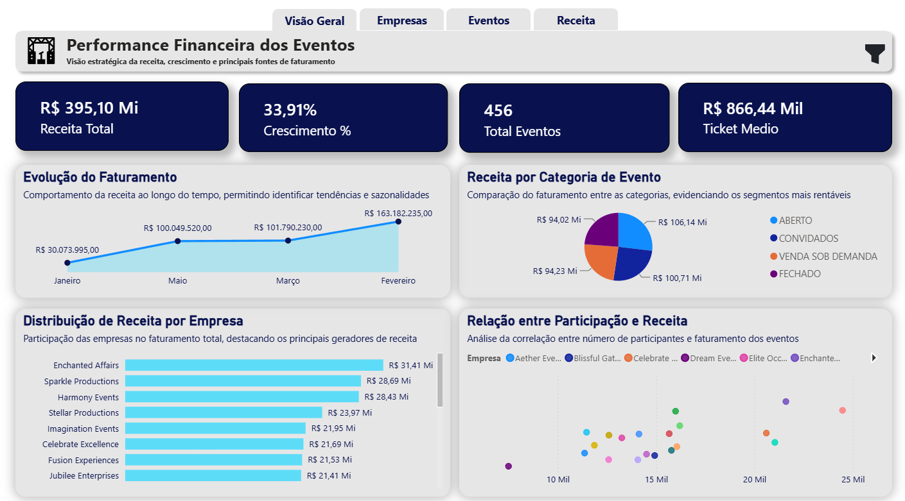
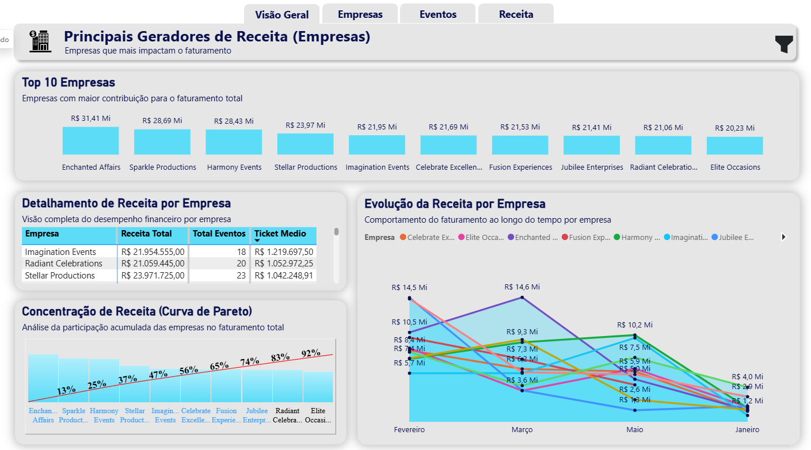
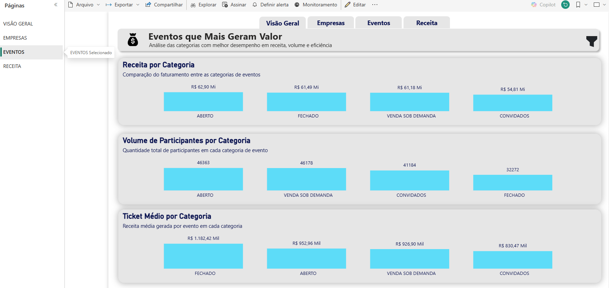
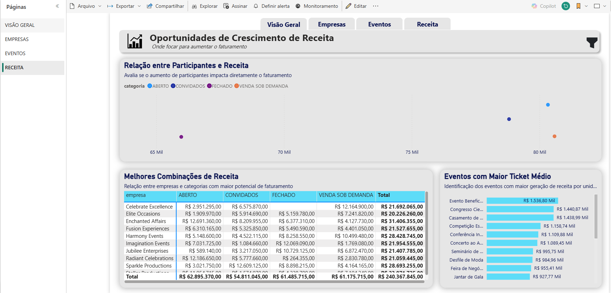

# 🎪 Projeto 05 — Eventos | Business Intelligence

<p align="center">
  
  
  
  
</p>

<p align="center">
  <strong>Business Intelligence • Modelagem de Dados • SQL • Power Query • DAX • Dashboard Interativo</strong>
</p>

---

# 📌 Visão Geral

O **Projeto 05 — Eventos** é um projeto de **Business Intelligence desenvolvido no Power BI**, com foco na análise financeira e operacional de eventos.

O objetivo principal foi transformar dados relacionados a **eventos, empresas, categorias, participantes e receitas** em informações úteis para análise de desempenho e tomada de decisão.

O projeto apresenta uma visão estratégica sobre o comportamento da receita, permitindo identificar:

* Empresas com maior geração de faturamento;
* Categorias de eventos mais rentáveis;
* Evolução da receita;
* Volume de participantes;
* Ticket médio;
* Eventos com maior geração de receita;
* Relação entre participantes e faturamento;
* Concentração da receita entre empresas;
* Combinações de empresas e categorias com maior potencial de faturamento.

O dashboard foi estruturado para permitir uma análise **gerencial, financeira e operacional**, utilizando recursos de modelagem, tratamento de dados, medidas DAX e visualizações interativas.

> 💡 O principal aprendizado deste projeto foi compreender como transformar dados de eventos em indicadores de negócio capazes de apoiar análises de desempenho, receita e oportunidades de crescimento.

---

# 🎯 Objetivo do Projeto

Construir um dashboard interativo capaz de analisar o desempenho financeiro dos eventos e identificar os principais fatores relacionados à geração de receita.

O projeto busca responder perguntas como:

* Qual é a receita total gerada pelos eventos?
* Quantos eventos foram realizados?
* Qual é o ticket médio?
* Quais empresas geram mais receita?
* Quais categorias possuem maior faturamento?
* Quais categorias possuem maior volume de participantes?
* Quais eventos apresentam maior ticket médio?
* Existe relação entre quantidade de participantes e receita?
* Quais empresas concentram a maior parcela do faturamento?
* Quais combinações entre empresa e categoria apresentam maior potencial de receita?

---

# 🧠 Desafio de Dados

O principal desafio foi transformar os dados brutos relacionados aos eventos em informações organizadas para análise no Power BI.

Os dados envolvem diferentes entidades e características, como:

```text
Eventos
   │
   ├── Empresas
   │
   ├── Categorias
   │
   ├── Participantes
   │
   ├── Receita
   │
   └── Indicadores financeiros
```

A organização dessas informações permite analisar os dados sob diferentes perspectivas e criar relacionamentos entre as entidades.

O projeto também utiliza conceitos de **modelagem de dados, transformação, medidas e contexto de filtro**.

---

# 🏗️ Arquitetura do Projeto

O projeto foi estruturado utilizando conceitos de **Business Intelligence e modelagem de dados**.

A organização permite relacionar informações de eventos, empresas e categorias com os indicadores financeiros.

```text
                         EMPRESAS
                            │
                            │
                            ▼
                       FATO_EVENTOS
                       /     │      \
                      /      │       \
                     ▼       ▼        ▼
              CATEGORIAS  RECEITA  PARTICIPANTES
```

A estrutura permite analisar a receita sob diferentes dimensões e criar indicadores para apoiar a tomada de decisão.

---

# 🗄️ Dados e SQL Server

O projeto utiliza dados relacionados ao gerenciamento e análise de eventos.

Entre as estruturas utilizadas estão:

```text
events
empresas
categorias
```

Também foram desenvolvidas estruturas para facilitar a análise dos dados:

```text
vw_receita_empresa
vw_receita_categoria
vw_eventos_mes
vw_participantes_categoria
vw_fato_eventos
```

Essas estruturas permitem preparar os dados antes da utilização no Power BI e facilitar a construção dos indicadores.

---

# 🔄 ETL — Power Query

O processo de preparação dos dados utiliza o **Power Query**.

Fluxo geral:

```text
Fonte de Dados
      ↓
Importação
      ↓
Tratamento dos Dados
      ↓
Alteração dos Tipos
      ↓
Limpeza
      ↓
Estruturação
      ↓
Modelo de Dados
      ↓
Power BI
```

---

## 🧹 Tratamento dos Dados

Durante o processo de preparação foram trabalhadas etapas relacionadas a:

* Importação dos dados;
* Tratamento das informações;
* Alteração dos tipos de dados;
* Organização das colunas;
* Tratamento de valores;
* Estruturação das tabelas;
* Preparação dos dados para análise;
* Criação de estruturas específicas para o dashboard.

O objetivo foi garantir uma base adequada para criação das medidas e visualizações.

---

# 🔗 Modelagem de Dados

A modelagem foi desenvolvida considerando as relações entre as principais entidades do projeto.

```text
EMPRESAS
   │
   │
   ▼
EVENTOS ─────────── CATEGORIAS
   │
   │
   ├────────────── PARTICIPANTES
   │
   └────────────── RECEITA
```

A correta organização dos relacionamentos permite utilizar filtros e segmentações de forma consistente no dashboard.

---

# 📐 DAX

O projeto utiliza **DAX — Data Analysis Expressions** para criação dos principais indicadores.

Entre os conceitos utilizados estão:

```DAX
SUM()
COUNT()
AVERAGE()
CALCULATE()
FILTER()
ALL()
DIVIDE()
```

As medidas permitem realizar cálculos financeiros, comparações, percentuais e indicadores de desempenho.

---

# 🧮 Principais Indicadores

O dashboard apresenta indicadores estratégicos relacionados ao desempenho dos eventos.

### 💰 Receita Total

Representa o faturamento total gerado pelos eventos analisados.

**Resultado apresentado no dashboard:**

```text
R$ 395,10 Mi
```

---

### 📈 Crescimento

Indicador utilizado para apresentar a evolução percentual da receita.

**Resultado apresentado:**

```text
33,91%
```

---

### 🎪 Total de Eventos

Quantidade total de eventos registrados na base.

```text
456 eventos
```

---

### 💵 Ticket Médio

Representa a receita média associada aos eventos.

```text
R$ 866,44 Mil
```

---

# 📊 Estrutura do Dashboard

O relatório foi dividido em quatro páginas principais:

```text
📄 VISÃO GERAL
│
├── 🏢 EMPRESAS
│
├── 🎪 EVENTOS
│
└── 💰 RECEITA
```

Essa organização permite navegar entre diferentes níveis de análise.

---

# 🏠 1. Visão Geral

A página **Visão Geral** apresenta uma visão estratégica da performance financeira dos eventos.

Os principais indicadores apresentados são:

* Receita Total;
* Crescimento;
* Total de Eventos;
* Ticket Médio.

Também são apresentadas análises relacionadas a:

* Evolução do faturamento;
* Receita por categoria;
* Receita por empresa;
* Relação entre participantes e receita.

---

## 📈 Evolução do Faturamento

A análise apresenta o comportamento da receita ao longo do período.

Valores apresentados no dashboard:

| Período   |      Receita |
| --------- | -----------: |
| Janeiro   |  R$ 30,07 Mi |
| Março     | R$ 101,79 Mi |
| Maio      | R$ 100,05 Mi |
| Fevereiro | R$ 163,18 Mi |

Essa visualização permite identificar variações e tendências no faturamento.

---

## 🥧 Receita por Categoria

A receita também foi analisada de acordo com a categoria dos eventos.

As categorias utilizadas são:

```text
ABERTO
CONVIDADOS
VENDA SOB DEMANDA
FECHADO
```

Na visão geral, os valores apresentados ficam próximos de:

```text
ABERTO              R$ 106,14 Mi
CONVIDADOS          R$ 100,71 Mi
VENDA SOB DEMANDA   R$ 94,23 Mi
FECHADO             R$ 94,02 Mi
```

Essa análise permite comparar a contribuição de cada categoria para o faturamento total.

---

# 🏢 2. Empresas

A página **Empresas** apresenta uma visão detalhada sobre os principais geradores de receita.

---

## 🏆 Top 10 Empresas

Entre as empresas com maior faturamento apresentado no dashboard estão:

| Empresa              | Receita aproximada |
| -------------------- | -----------------: |
| Enchanted Affairs    |        R$ 31,41 Mi |
| Sparkle Productions  |        R$ 28,69 Mi |
| Harmony Events       |        R$ 28,43 Mi |
| Stellar Productions  |        R$ 23,97 Mi |
| Imagination Events   |        R$ 21,95 Mi |
| Celebrate Excellence |        R$ 21,69 Mi |
| Fusion Experiences   |        R$ 21,53 Mi |
| Jubilee Enterprises  |        R$ 21,41 Mi |
| Radiant Celebrations |        R$ 21,06 Mi |
| Elite Occasions      |        R$ 20,23 Mi |

Essa análise permite identificar as empresas que mais contribuem para o faturamento.

---

## 📋 Detalhamento de Receita por Empresa

A página também apresenta uma tabela detalhada contendo informações como:

* Empresa;
* Receita Total;
* Total de Eventos;
* Ticket Médio.

Exemplo apresentado:

```text
Empresa                 Receita Total       Eventos       Ticket Médio
----------------------------------------------------------------------
Imagination Events      R$ 21,95 Mi         18            R$ 1,22 Mi
Radiant Celebrations    R$ 21,06 Mi         20            R$ 1,05 Mi
Stellar Productions     R$ 23,97 Mi         23            R$ 1,04 Mi
```

---

# 📊 Curva de Pareto

Foi utilizada uma **Curva de Pareto** para analisar a concentração da receita entre as empresas.

A análise permite observar a participação acumulada das empresas no faturamento total.

Entre os percentuais apresentados estão:

```text
13%
25%
37%
47%
56%
65%
74%
83%
92%
```

Essa visualização ajuda a identificar o quanto da receita está concentrado nas principais empresas.

---

# 📈 Evolução da Receita por Empresa

Também foi desenvolvida uma análise temporal do faturamento por empresa.

Essa visualização permite comparar o comportamento das principais empresas ao longo dos períodos analisados.

O objetivo é identificar:

* Empresas com crescimento;
* Empresas com queda;
* Variações de receita;
* Diferenças de desempenho;
* Oportunidades de análise.

---

# 🎪 3. Eventos

A página **Eventos** apresenta uma análise específica das categorias de eventos.

O objetivo é identificar quais categorias apresentam melhor desempenho em:

* Receita;
* Volume;
* Eficiência;
* Ticket médio.

---

## 💰 Receita por Categoria

Os valores apresentados no dashboard são:

| Categoria         |     Receita |
| ----------------- | ----------: |
| ABERTO            | R$ 62,90 Mi |
| FECHADO           | R$ 61,49 Mi |
| VENDA SOB DEMANDA | R$ 61,18 Mi |
| CONVIDADOS        | R$ 54,81 Mi |

Essa análise permite comparar o faturamento gerado por cada categoria.

---

## 👥 Volume de Participantes por Categoria

A quantidade de participantes também foi analisada.

| Categoria         | Participantes |
| ----------------- | ------------: |
| ABERTO            |        46.363 |
| VENDA SOB DEMANDA |        46.178 |
| CONVIDADOS        |        41.184 |
| FECHADO           |        32.272 |

Essa informação permite comparar o volume de participantes com a receita gerada.

---

## 💵 Ticket Médio por Categoria

O ticket médio apresenta a receita média gerada por evento em cada categoria.

Os valores apresentados são aproximadamente:

| Categoria         |    Ticket Médio |
| ----------------- | --------------: |
| FECHADO           | R$ 1.182,42 Mil |
| ABERTO            |   R$ 952,96 Mil |
| VENDA SOB DEMANDA |   R$ 926,90 Mil |
| CONVIDADOS        |   R$ 830,47 Mil |

Essa análise permite identificar categorias com maior geração de receita por evento.

---

# 💰 4. Receita

A página **Receita** possui foco nas oportunidades de crescimento e geração de faturamento.

---

## 👥 Relação entre Participantes e Receita

O gráfico de dispersão permite analisar a relação entre quantidade de participantes e receita.

A análise busca responder:

> O aumento da quantidade de participantes está diretamente relacionado ao aumento do faturamento?

A visualização permite comparar diferentes categorias e observar seus comportamentos.

---

## 🔎 Melhores Combinações de Receita

Foi desenvolvida uma matriz relacionando:

```text
Empresa × Categoria × Receita
```

As categorias analisadas são:

```text
ABERTO
CONVIDADOS
FECHADO
VENDA SOB DEMANDA
```

Essa análise permite identificar quais combinações entre empresas e categorias apresentam maior potencial de faturamento.

---

# 🏆 Eventos com Maior Ticket Médio

A página Receita também apresenta os eventos com maior ticket médio.

Essa análise permite identificar eventos que apresentam maior geração de receita por unidade.

Entre os eventos apresentados estão categorias como:

* Evento Beneficente;
* Congresso;
* Casamento;
* Competição;
* Conferência;
* Concerto;
* Seminário;
* Desfile de Moda;
* Feira;
* Jantar de Gala.

O objetivo é identificar os eventos com maior potencial de geração de receita por evento.

---

# 📊 Principais Análises

O dashboard permite realizar diferentes análises estratégicas.

### 1. Performance Financeira

Avaliação da receita total e evolução do faturamento.

### 2. Empresas

Identificação dos principais geradores de receita.

### 3. Categorias

Comparação entre categorias de eventos.

### 4. Participantes

Análise do volume de participantes por categoria.

### 5. Ticket Médio

Identificação das categorias e eventos com maior receita média.

### 6. Pareto

Análise da concentração do faturamento entre empresas.

### 7. Correlação

Análise da relação entre participantes e receita.

### 8. Oportunidades

Identificação das melhores combinações entre empresas e categorias.

---

# 🔎 Insights da Análise

A construção do dashboard permitiu identificar alguns pontos relevantes.

### 💰 Receita

O faturamento total analisado alcançou aproximadamente:

```text
R$ 395,10 milhões
```

---

### 🎪 Volume de Eventos

A base apresenta:

```text
456 eventos
```

---

### 🏢 Empresas

A empresa **Enchanted Affairs** aparece como o principal gerador de receita entre as empresas apresentadas, com aproximadamente:

```text
R$ 31,41 milhões
```

---

### 📊 Categorias

A categoria **ABERTO** apresenta a maior receita na análise de categorias:

```text
R$ 62,90 milhões
```

---

### 👥 Participantes

A categoria **ABERTO** também apresenta o maior volume de participantes:

```text
46.363 participantes
```

---

### 💵 Ticket Médio

A categoria **FECHADO** apresenta o maior ticket médio entre as categorias analisadas:

```text
R$ 1.182,42 mil
```

Isso demonstra que uma categoria pode não possuir o maior volume de participantes ou receita total e ainda assim apresentar maior receita média por evento.

---

# 🧠 Principais Aprendizados

Este projeto contribuiu para o desenvolvimento de conhecimentos em diferentes áreas de Business Intelligence.

### 🗄️ SQL

* Consultas;
* Tratamento de dados;
* Criação de views;
* Organização das informações;
* Estruturação da base para análise.

### 🔄 Power Query

* Importação;
* Transformação;
* Tratamento;
* Tipagem;
* Organização dos dados;
* Preparação para o modelo.

### 📐 DAX

* Medidas;
* `SUM`;
* `COUNT`;
* `AVERAGE`;
* `CALCULATE`;
* `FILTER`;
* `ALL`;
* `DIVIDE`;
* Contexto de filtro;
* Cálculos percentuais;
* Indicadores financeiros.

### 📊 Power BI

* Modelagem;
* Relacionamentos;
* KPIs;
* Gráficos;
* Matrizes;
* Gráficos de dispersão;
* Curva de Pareto;
* Filtros;
* Navegação;
* Dashboard interativo.

### 📈 Análise de Negócios

* Receita;
* Crescimento;
* Ticket médio;
* Participação;
* Concentração;
* Comparação;
* Identificação de oportunidades.

---

# 🎨 Design e Identidade Visual

O dashboard utiliza uma identidade visual consistente, com destaque para:

* Fundo claro;
* Elementos em azul escuro;
* Gráficos em tons de azul;
* Cards de indicadores;
* Títulos padronizados;
* Navegação superior;
* Ícones;
* Bordas arredondadas;
* Sombras;
* Rótulos de dados.

A organização visual foi desenvolvida com foco em facilitar a leitura dos indicadores e permitir uma navegação intuitiva.

---

# 🧭 Navegação

O relatório possui um menu superior para navegação entre as páginas:

```text
┌─────────────────────────────────────────────────────┐
│ Visão Geral │ Empresas │ Eventos │ Receita          │
└─────────────────────────────────────────────────────┘
```

As páginas são organizadas de acordo com o nível de análise:

```text
VISÃO GERAL
     ↓
EMPRESAS
     ↓
EVENTOS
     ↓
RECEITA
```

Essa estrutura permite iniciar pela visão estratégica e aprofundar a análise conforme a necessidade.

---

# 📊 Visualizações Utilizadas

Entre os principais recursos utilizados estão:

* Cartões de indicadores;
* Gráficos de linha;
* Gráficos de barras;
* Gráficos de colunas;
* Gráfico de pizza;
* Gráfico de dispersão;
* Matrizes;
* Curva de Pareto;
* Filtros;
* Navegação entre páginas.

---

# 🛠️ Tecnologias

<p align="center">
  
  
  
  
</p>

| Tecnologia      | Aplicação                                       |
| --------------- | ----------------------------------------------- |
| **Power BI**    | Dashboard, modelagem e visualização             |
| **Power Query** | Tratamento e transformação dos dados            |
| **DAX**         | Medidas, cálculos e indicadores                 |
| **SQL Server**  | Armazenamento, consultas e preparação dos dados |
| **SQL**         | Consultas e criação de views                    |

---

# 📂 Estrutura do Repositório

```text
projeto-05-eventos/
│
├── README.md
│
├── dados/
│   └── base-eventos.xlsx
│
├── dashboard/
│   └── projeto-eventos.pbix
│
├── imagens/
│   ├── visao-geral.png
│   ├── empresas.png
│   ├── eventos.png
│   └── receita.png
│
└── sql/
    ├── tabelas.sql
    ├── views.sql
    └── consultas.sql
```

> Os nomes dos arquivos podem ser ajustados conforme a estrutura final do projeto.

---

# 📸 Dashboard

## 📊 Visão Geral

<p align="center">
  
</p>

A página apresenta os principais indicadores financeiros e operacionais do projeto, incluindo receita total, crescimento, quantidade de eventos, ticket médio, evolução do faturamento e principais empresas.

---

## 🏢 Empresas

<p align="center">
  
</p>

Página dedicada à análise dos principais geradores de receita, incluindo Top 10 empresas, detalhamento financeiro, evolução e concentração de receita.

---

## 🎪 Eventos

<p align="center">
  
</p>

Página dedicada à análise das categorias de eventos, volume de participantes, receita e ticket médio.

---

## 💰 Receita

<p align="center">
  
</p>

Página destinada à identificação de oportunidades de crescimento, análise da relação entre participantes e receita, melhores combinações de receita e eventos com maior ticket médio.

---

# 📌 Competências Demonstradas

Este projeto demonstra conhecimentos em:

```text
Business Intelligence
        │
        ├── SQL
        │
        ├── Tratamento de Dados
        │
        ├── Power Query / ETL
        │
        ├── Modelagem de Dados
        │
        ├── Relacionamentos
        │
        ├── DAX
        │
        ├── Indicadores Financeiros
        │
        ├── Análise de Empresas
        │
        ├── Análise de Eventos
        │
        ├── Análise de Receita
        │
        ├── Ticket Médio
        │
        ├── Pareto
        │
        ├── Análise de Participantes
        │
        └── Data Visualization
```

---

# 🚀 Resultado

O resultado final é um **dashboard interativo de Business Intelligence voltado para análise de eventos**, permitindo transformar dados operacionais e financeiros em informações estratégicas.

O projeto apresenta uma visão completa do processo:

```text
DADOS
  ↓
SQL
  ↓
TRATAMENTO
  ↓
MODELAGEM
  ↓
POWER QUERY
  ↓
DAX
  ↓
INDICADORES
  ↓
VISUALIZAÇÃO
  ↓
ANÁLISE
  ↓
INSIGHTS
```

O dashboard permite analisar o desempenho das empresas, categorias e eventos, identificando os principais geradores de receita e oportunidades de crescimento.

---

# 📚 Conteúdos Praticados

* [x] Importação de dados
* [x] SQL
* [x] Consultas SQL
* [x] Views
* [x] Power Query
* [x] ETL
* [x] Tratamento de dados
* [x] Modelagem de dados
* [x] Relacionamentos
* [x] Medidas DAX
* [x] `SUM`
* [x] `COUNT`
* [x] `AVERAGE`
* [x] `CALCULATE`
* [x] `FILTER`
* [x] `ALL`
* [x] `DIVIDE`
* [x] Contexto de filtro
* [x] Indicadores financeiros
* [x] Receita
* [x] Crescimento
* [x] Ticket médio
* [x] Análise de empresas
* [x] Análise de eventos
* [x] Análise de categorias
* [x] Análise de participantes
* [x] Curva de Pareto
* [x] Gráfico de dispersão
* [x] Dashboard interativo
* [x] Navegação entre páginas
* [x] Data Visualization

---

# 📈 Evolução do Projeto

Este projeto representa uma evolução no desenvolvimento das habilidades em **Data Analytics e Business Intelligence**.

Além da construção das visualizações, o projeto envolve diferentes etapas do processo analítico:

```text
Entendimento do Problema
          ↓
Preparação dos Dados
          ↓
SQL
          ↓
Power Query
          ↓
Modelagem
          ↓
DAX
          ↓
KPIs
          ↓
Dashboard
          ↓
Análise
          ↓
Insights
```

Essa abordagem demonstra uma visão mais completa do trabalho de um profissional de **Data Analytics**, desde a preparação dos dados até a interpretação das informações.

---

# 📌 Status do Projeto

🟢 **Concluído**

Projeto desenvolvido para prática e consolidação de conhecimentos em:

**SQL • Power BI • Power Query • DAX • Modelagem de Dados • Business Intelligence**

---

# 👨‍💻 Autor

**Robson Pereira Machado**

📊 Data Analytics | Business Intelligence
💻 Power BI • SQL • Python • Excel
🎓 Ciência de Dados

---

## 🔗 Portfólio

Este projeto faz parte do meu portfólio de projetos em **Data Analytics**.

📁 **Repositório principal:**

`portfolio-data-analytics`

---

<p align="center">

⭐ <strong>Obrigado por visitar este projeto!</strong>

</p>

<p align="center">

<strong>Transformando dados em informações para apoiar decisões.</strong>

</p>
