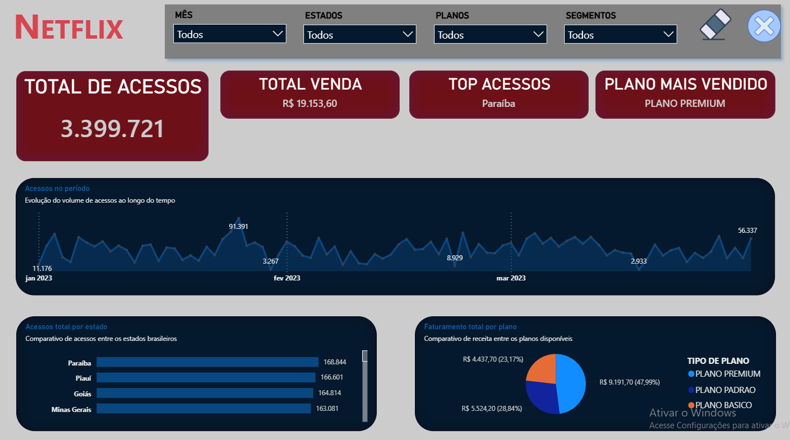
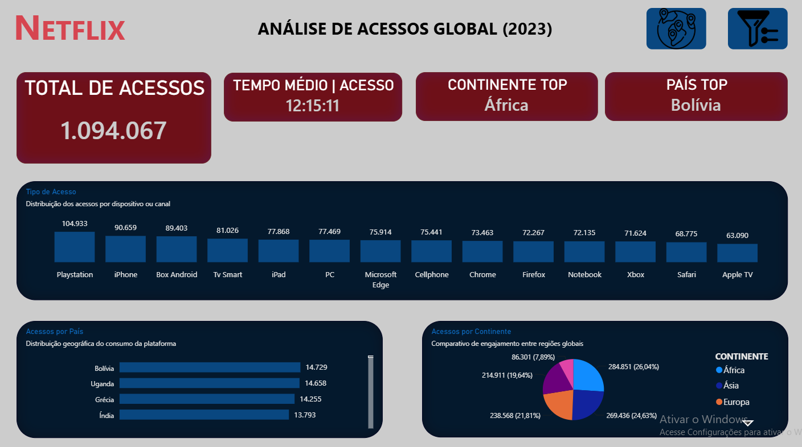

# 🎬 Projeto 06 — Análise de Acessos da Netflix

### 🚀 Pipeline de Dados com SQL Server + Power BI

Projeto desenvolvido com o objetivo de construir um fluxo completo de análise de dados, partindo de dados brutos de acessos da Netflix até a criação de uma camada analítica preparada para consumo no Power BI.

O foco principal do projeto foi trabalhar não apenas a visualização dos dados, mas também a **organização, tratamento, padronização e estruturação das informações antes da construção do dashboard**.

---

## 📌 Sobre o Projeto

Neste projeto foi desenvolvido um pipeline de dados utilizando **SQL Server** e **Power BI**, passando pelas etapas de exploração, tratamento, transformação e disponibilização dos dados para análise.

A estrutura foi organizada separando os **dados brutos** da **camada analítica**, permitindo maior organização e controle sobre o processo de transformação dos dados.

O projeto utiliza dados relacionados aos acessos da Netflix, possibilitando análises em diferentes níveis, incluindo informações gerais e dados relacionados aos países.

---

## 🔄 Pipeline do Projeto

~~~text
Dados Brutos
     │
     ▼
SQL Server
     │
     ├── Análise das tabelas originais
     │
     ├── Tratamento dos dados
     │
     ├── Padronização
     │
     ├── Ajuste dos tipos de dados
     │
     ▼
Camada Analítica
     │
     ├── Views Analíticas
     │
     ├── Ano
     ├── Mês
     └── Trimestre
     │
     ▼
Power BI
     │
     ▼
Dashboard
~~~

---

## 🔎 Etapa 1 — Exploração e Tratamento dos Dados

A primeira etapa foi realizada utilizando o **Microsoft SQL Server**, começando pela análise das tabelas originais.

### Principais atividades

- Análise exploratória das tabelas originais;
- Identificação da estrutura dos dados;
- Criação de tabelas tratadas;
- Separação entre dados brutos e dados analíticos;
- Padronização dos nomes das colunas;
- Ajuste dos tipos de dados;
- Preparação dos dados para as etapas seguintes.

Entre os tipos de dados trabalhados estão:

~~~text
DATE
INT
DECIMAL
TIME
~~~

Também foi realizado o tratamento de campos relacionados a tempo utilizando conversões como:

~~~sql
CAST(... AS TIME(0))
~~~

Essa etapa foi importante para garantir que os dados chegassem à camada analítica de forma mais consistente e adequada para utilização no Power BI.

---

## 🗄️ Etapa 2 — Estruturação da Camada Analítica

Após o tratamento das tabelas, foi criada uma camada específica para consumo analítico.

Nessa etapa foram desenvolvidas **Views SQL**, organizando os dados de maneira mais adequada para análises no Power BI.

### As views incluem informações como:

- Ano;
- Mês;
- Trimestre;
- Campos organizados semanticamente;
- Informações preparadas para análise temporal.

Essa abordagem permite que o Power BI consuma uma estrutura previamente organizada, reduzindo a necessidade de realizar transformações complexas diretamente no dashboard.

---

## 📊 Etapa 3 — Power BI

Com a camada analítica estruturada no SQL Server, os dados foram utilizados no **Power BI** para construção do dashboard.

O objetivo foi transformar os dados tratados em visualizações que permitissem analisar os acessos da Netflix de maneira mais clara e interativa.

### 🇧🇷 Dashboard — Brasil

### 🌎 Dashboard — Visão Global

---

## 🎯 Resultado

O resultado foi um pipeline estruturado que conecta:

**Dados → SQL Server → Tratamento → Camada Analítica → Power BI → Dashboard**

A principal proposta do projeto foi demonstrar que uma análise de dados eficiente não começa no dashboard.

Antes da visualização, é necessário garantir que os dados estejam:

- Organizados;
- Padronizados;
- Estruturados;
- Com tipos de dados adequados;
- Preparados para análise.

Esse processo contribui para uma camada de BI mais organizada e facilita a manutenção e evolução das análises.

---

## 🛠️ Tecnologias Utilizadas

| Tecnologia | Utilização |
|---|---|
| **SQL Server** | Banco de dados, tratamento e consultas |
| **SQL** | Criação e transformação dos dados |
| **Power BI** | Dashboard e visualização |
| **Excel** | Fonte e organização dos dados |
| **CSV** | Dados brutos utilizados no projeto |
| **Modelagem Relacional** | Estruturação dos dados |
| **Views SQL** | Criação da camada analítica |

---

## 📂 Dados Utilizados

Os arquivos utilizados no projeto estão organizados na pasta `dados/`.

~~~text
dados/
├── NETFLIX(ACESSOS GERAL).csv
├── NETFLIX(ACESSOS PAISES).csv
└── NETFLIX.xlsx
~~~

---

## 🗃️ Scripts SQL

O projeto possui um script SQL responsável pela criação da estrutura do banco e inserção dos dados.

~~~text
sql/
└── 1_CRIACAO_DE_BANCO+INSERTS.sql
~~~

---

## 📊 Dashboard

O dashboard desenvolvido no Power BI está disponível no arquivo:

~~~text
dashboard/
└── projeto_netflix.pbix
~~~

### 🔗 Dashboard publicado

[**Acessar Dashboard no Power BI**](https://lnkd.in/dtFJsGJC)

---

## 📁 Estrutura do Projeto

~~~text
projeto-06-netflix/
│
├── dados/
│   ├── NETFLIX(ACESSOS GERAL).csv
│   ├── NETFLIX(ACESSOS PAISES).csv
│   └── NETFLIX.xlsx
│
├── dashboard/
│   └── projeto_netflix.pbix
│
├── imagens/
│   ├── brasil.png
│   └── global.png
│
├── sql/
│   └── 1_CRIACAO_DE_BANCO+INSERTS.sql
│
└── README.md
~~~

---

## 📚 Principais Competências Desenvolvidas

- Análise exploratória de dados;
- Tratamento e transformação de dados;
- SQL Server;
- SQL;
- Criação de tabelas;
- Criação de Views;
- Modelagem relacional;
- Padronização de dados;
- Tratamento de tipos de dados;
- Análise temporal;
- Power BI;
- Construção de dashboards;
- Organização de pipelines de dados;
- Separação entre camada bruta e camada analítica.

---

## 💡 Aprendizado do Projeto

Este projeto reforçou uma etapa fundamental do trabalho com dados:

> **Um bom dashboard começa com dados bem estruturados.**

A experiência permitiu trabalhar o processo de análise de ponta a ponta, compreendendo a importância de preparar e organizar os dados antes de disponibilizá-los para ferramentas de Business Intelligence.

---

## 👨‍💻 Autor

**Robson Pereira Machado**

Estudante de **Ciência de Dados** com foco em **Análise de Dados e Business Intelligence**.

🔗 [GitHub — robs-data](https://github.com/robs-data)

---

⭐ Se você gostou do projeto, considere deixar uma estrela no repositório.